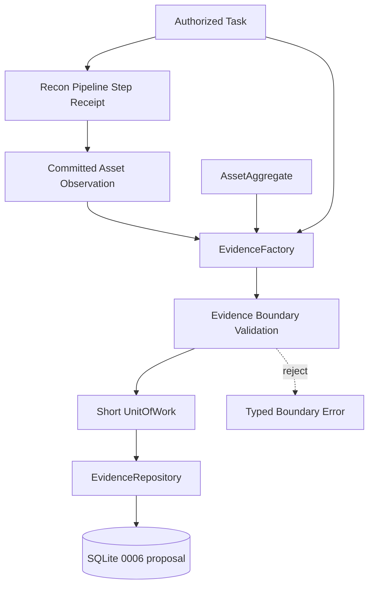

# Module 1.3 — Recon Evidence & Provenance Ledger

**Status:** Implemented and closed — Module 1.3  
**Baseline:** Module 0 closed; Module 1.0 closed; Module 1.1 closed at checkpoint `3ba4bf40`; Module 1.2 closed at checkpoint `e344411c`  
**Migration:** `0006_recon_evidence.sql` — created, applied, checksum-verified  
**Security posture:** Fail-closed, authorization-bound, provenance-preserving, privacy-first  

> هذه الوثيقة تسجل التصميم والتنفيذ المنجز لطبقة Evidence & Provenance فوق أصول Recon ونتائج Pipeline الملتزمة. لا ينفذ Module 1.3 Recon حقيقيًا، ولا Network Adapter، ولا Raw Artifact Store، ولا CLI أو Web UI أو AI/LLM.

## 1. Executive decision

بعد إغلاق Module 1.2، أصبحت المنظومة قادرة على تنفيذ Pipeline آمن وحفظ الأصول المنظمة مع provenance على مستوى Task وTarget وScope. الفجوة التالية ليست تشغيل أداة شبكة جديدة، بل حفظ **الدليل القابل للمراجعة** الذي يربط كل ملاحظة أو أصل بعملية التنفيذ والـPlugin والـPipeline والـauthorization التي أنتجته.

لذلك يُقترح أن يكون Module 1.3 هو **Recon Evidence & Provenance Ledger**. هذه الشريحة لا تعيد بناء تخزين الأصول، ولا تنشئ نظام تقارير كاملًا، بل تضيف سجلًا منظمًا ومحدودًا للأدلة التي يمكن استخدامها لاحقًا في التحليل وكتابة التقارير.

### القرار المعماري المقترح

يصبح `EvidenceRecord` إسقاطًا domain-level مستقلًا عن SQLite، يرتبط بدليل منظم عبر `asset_observation_id` أو `asset_id`، ويحمل digest وmetadata آمنة بدل تخزين raw BLOB أو نصوص حساسة. كل Evidence يجب أن يكون مرتبطًا بسياق Task وScope وTarget ثابت، ولا يجوز إنشاؤه إلا من نتيجة Recon ملتزمة بالفعل.

## 2. Scope and non-goals

### داخل النطاق

يشمل التصميم عقد Evidence immutable، provenance chain، digesting policy، evidence classification، retention/archive semantics، repository port، transaction boundary، idempotency، وربط Evidence بنتيجة Recon الملتزمة ومخرجات Pipeline.

### خارج النطاق

لا يشمل هذا التصميم تشغيل Nmap أو DNS أو HTTP أو Subfinder أو httpx أو Burp أو Nuclei أو cloud scanners، ولا network sockets أو subprocess أو external APIs أو AI/LLM. كما لا يشمل raw artifact/BLOB storage، ولا file uploads، ولا CLI commands، ولا Web UI، ولا report generation، ولا findings أو vulnerability scoring، ولا تعديل Module 0 أو Module 1.0 أو Module 1.1.

## 3. Existing contracts reused

| Existing contract | Role in Module 1.3 | Forbidden change |
|---|---|---|
| `Task` | يحدد execution identity ومصدر الدليل | لا يتم إنشاء Task بديل |
| `ExecutionAuthorization` | يثبت أن الدليل نتج داخل Scope/Target مصرح به | لا يتم إنشاء Evidence authorization بديل |
| `ReconResult` | مصدر مؤقت قبل ingestion | لا يتم تحويل raw plugin payload إلى evidence تلقائيًا |
| `ReconIngestionService` | يثبت أن asset/observation التزما قبل إنشاء evidence | لا يتم تجاوز الخدمة أو تنفيذ SQL منها |
| `AssetAggregate` | الأصل المنظم الذي يشير إليه الدليل | لا يوسع الدليل Scope أو Target |
| `asset_observations` | provenance source وidempotency boundary | لا يتم تعديل سجل observation بعد الالتزام |
| `PipelineExecutionReport` | يحدد pipeline/step receipt والسياق التنفيذي | لا يُعتبر authorization model جديدًا |
| `SQLiteUnitOfWork` | يضمن transaction قصيرة لإنشاء evidence | لا توجد transaction طويلة عبر Pipeline كامل |

## 4. Evidence vocabulary

### `EvidenceId`

معرف UUID4 immutable. لا يحمل معنى أمنيًا ولا يُستخدم بدل authorization.

### `EvidenceKind`

قائمة مغلقة في هذه الشريحة، مثل `observation_summary`, `service_metadata`, `http_metadata`, و`query_digest`. أي نوع مجهول يُرفض بدل تخزينه كقيمة عامة.

### `EvidenceStatus`

الحالات المقترحة هي `ACTIVE` و`ARCHIVED`. لا يوجد hard delete. الأرشفة لا تمحو provenance ولا تسمح بإعادة استخدام evidence المؤرشف في نتيجة جديدة.

### `EvidenceRecord`

كائن immutable يمثل دليلًا منظمًا:

```text
EvidenceRecord(
  id: EvidenceId,
  scope_id: ScopeId,
  target_id: TargetId,
  task_id: TaskId,
  asset_id: AssetId,
  observation_id: ObservationId | None,
  kind: EvidenceKind,
  title: str,
  content_digest: Sha256Digest,
  content_size_bytes: int,
  metadata: Mapping[str, JSONPrimitive],
  source_plugin_id: str,
  source_plugin_version: PluginVersion,
  pipeline_id: str | None,
  pipeline_version: ContractVersion | None,
  collected_at: datetime,
  status: EvidenceStatus,
  version: int,
)
```

`content_digest` هو digest لمحتوى منظم canonicalized، وليس raw content. `metadata` يجب أن تكون bounded وJSON-valid وredacted قبل وصولها إلى repository. لا يحتوي الكائن على credentials أو raw query string أو arbitrary filesystem path.

## 5. Data flow and aggregate boundary



Evidence creation is **post-commit and provenance-bound**. The factory may create a candidate only when the referenced asset and observation are already committed and belong to the same Scope, Target, and Task context. The repository performs a final parent/provenance check inside the transaction.

## 6. Implemented persistence design (`0006_recon_evidence.sql`)

The exact executable DDL is in `src/cyberos/persistence/migrations/versions/0006_recon_evidence.sql` and is applied through `MigrationRunner`. The SQL shape below documents the approved relational contract; the migration additionally uses composite provenance foreign keys, `archived_at`, UTC `+00:00` checks, and a NULL-safe idempotency index.

```sql
CREATE TABLE evidence_records (
    id TEXT PRIMARY KEY NOT NULL,
    scope_id TEXT NOT NULL,
    target_id TEXT NOT NULL,
    task_id TEXT NOT NULL,
    asset_id TEXT NOT NULL,
    observation_id TEXT,
    kind TEXT NOT NULL CHECK (kind IN (
        'observation_summary',
        'service_metadata',
        'http_metadata',
        'query_digest'
    )),
    title TEXT NOT NULL CHECK (length(title) BETWEEN 1 AND 200),
    content_digest TEXT NOT NULL CHECK (
        length(content_digest) = 64 AND
        content_digest GLOB '[0-9a-f]*'
    ),
    content_size_bytes INTEGER NOT NULL CHECK (
        content_size_bytes BETWEEN 0 AND 1048576
    ),
    metadata_json TEXT NOT NULL CHECK (json_valid(metadata_json)),
    source_plugin_id TEXT NOT NULL CHECK (length(source_plugin_id) BETWEEN 1 AND 200),
    source_plugin_version TEXT NOT NULL CHECK (length(source_plugin_version) BETWEEN 1 AND 50),
    pipeline_id TEXT,
    pipeline_version TEXT,
    collected_at TEXT NOT NULL CHECK (
        collected_at GLOB '____-__-__T__:__:__Z' OR
        collected_at GLOB '____-__-__T__:__:__.*+__:__'
    ),
    status TEXT NOT NULL CHECK (status IN ('ACTIVE', 'ARCHIVED')),
    version INTEGER NOT NULL CHECK (version >= 1),
    created_at TEXT NOT NULL,
    updated_at TEXT NOT NULL,
    FOREIGN KEY (scope_id) REFERENCES scopes(id)
        ON DELETE RESTRICT ON UPDATE RESTRICT,
    FOREIGN KEY (target_id) REFERENCES targets(id)
        ON DELETE RESTRICT ON UPDATE RESTRICT,
    FOREIGN KEY (task_id) REFERENCES tasks(id)
        ON DELETE RESTRICT ON UPDATE RESTRICT,
    FOREIGN KEY (asset_id) REFERENCES assets(id)
        ON DELETE RESTRICT ON UPDATE RESTRICT,
    FOREIGN KEY (observation_id) REFERENCES asset_observations(id)
        ON DELETE RESTRICT ON UPDATE RESTRICT
);

CREATE UNIQUE INDEX uq_evidence_idempotency
    ON evidence_records (
        task_id, asset_id, observation_id, kind, content_digest
    );

CREATE INDEX ix_evidence_scope_target_status
    ON evidence_records (scope_id, target_id, status, collected_at DESC);

CREATE INDEX ix_evidence_task_collected
    ON evidence_records (task_id, collected_at DESC, id ASC);
```

The implemented migration follows the established forward-only rules: no `IF NOT EXISTS`, no inner `BEGIN`/`COMMIT`, checksum validation through `MigrationRunner`, and integrity checks with `quick_check` and `foreign_key_check`. It stores lowercase `active`/`archived` status values, retains `archived_at`, and uses `ifnull(observation_id, '')` in the unique idempotency index so asset-level and observation-level evidence remain deterministic.

### Parent consistency invariant

Foreign keys alone do not prove that `scope_id`, `target_id`, `task_id`, and `asset_id` describe the same execution context. The domain factory and repository must load the parent rows and reject any cross-scope, cross-target, or cross-task combination. This invariant must not be delegated to a UI or caller.

## 7. Domain and repository interfaces

```text
EvidenceFactory
  from_observation(
    task: Task,
    authorization: ExecutionAuthorization,
    asset: AssetAggregate,
    observation: AssetObservation,
    kind: EvidenceKind,
    metadata: Mapping[str, JSONPrimitive],
  ) -> EvidenceRecord
```

```text
ReconEvidenceRepositoryPort
  add(record: EvidenceRecord) -> EvidenceRecord
  get(evidence_id: EvidenceId) -> EvidenceRecord | None
  list_by_task(task_id: TaskId, include_archived: bool = False) -> tuple[EvidenceRecord, ...]
  list_by_asset(asset_id: AssetId, include_archived: bool = False) -> tuple[EvidenceRecord, ...]
  archive(evidence_id: EvidenceId, expected_version: int) -> EvidenceRecord
```

`SQLiteReconEvidenceRepository` is the persistence adapter. It translates SQLite integrity failures into typed CyberOS errors and must never leak `sqlite3.Error`, SQL text, or row objects outside the persistence layer.

## 8. Deduplication and correlation rules

Evidence idempotency is based on the deterministic tuple:

```text
(task_id, asset_id, observation_id, evidence_kind, content_digest)
```

The same committed observation may produce one logical evidence record of a given kind and digest. Replaying a committed pipeline result returns the existing record or a typed idempotent outcome; it must not create duplicates. A changed digest creates a new evidence record and preserves the previous record for auditability.

Evidence correlation may not use raw target strings, fuzzy matching, timestamps alone, or plugin-provided arbitrary IDs. Canonical asset and observation identities remain the only correlation boundary.

## 9. Security and privacy boundaries

The following rules are mandatory:

| Boundary | Enforcement |
|---|---|
| Authorization | `authorization.scope_id == task.scope_id`, target IDs match, decision is `INCLUDED`, and expiry remains valid |
| Provenance | asset and observation must be committed and linked to the same Task/Scope/Target |
| Metadata | bounded JSON, allowlisted keys by EvidenceKind, control characters rejected, secrets and credentials rejected |
| Content | only canonical digest and size are persisted; raw payload/BLOB is deferred |
| Storage reference | no arbitrary filesystem path, URL, socket address, or external object locator in this slice |
| Lifecycle | archive-only; archived evidence cannot be silently reactivated or mutated |
| Concurrency | `expected_version` required for archive/update operations |
| Errors | typed and redacted; no SQL, traceback, raw payload, or credential leakage |

`EvidenceFactory` must refuse a candidate if authorization has expired between Pipeline ingestion and evidence creation. A valid old observation is not a permission to create new evidence after authorization expiry.

## 10. Transaction and failure semantics

Evidence creation uses one short UnitOfWork transaction per evidence batch created from a committed step. The transaction revalidates parent identity, provenance, status, limits, and idempotency before commit. A failed batch rolls back all new evidence records in that batch; it does not delete or rewrite previously committed assets, observations, or evidence.

There is no automatic retry policy in Module 1.3. A caller may safely replay a batch because the idempotency key is deterministic. A conflict caused by a changed version or archived parent is a typed failure requiring an explicit new operation.

## 11. Test and verification strategy

The implementation must prove the following without network, subprocess, or external services:

| Test family | Required proof |
|---|---|
| Domain validation | immutable IDs, bounded title/metadata, known kind, UTC timestamps, digest format |
| Authorization binding | expired, excluded, cross-scope, cross-target, and cross-task evidence candidates are rejected |
| Provenance | missing or uncommitted asset/observation cannot create evidence |
| Round-trip | `EvidenceRecord` survives mapper/repository round-trip without digest or metadata drift |
| Idempotency | replaying the same tuple does not duplicate records; changed digest creates a new record |
| FK and integrity | `quick_check`, `foreign_key_check`, RESTRICT behavior, checksum and forward-only migration |
| Archive semantics | no hard delete; archived evidence is excluded by default and cannot be silently reactivated |
| Concurrency | stale version fails with typed concurrency conflict |
| Privacy | credentials, raw query strings, arbitrary paths, control characters, and oversized metadata are rejected |
| Atomicity | failed batch leaves no partial evidence rows while previous committed rows remain |
| Static boundary | no socket, DNS, HTTP, subprocess, external API, AI/LLM, scanner, or raw artifact store |

## 12. Approved decisions and implementation status

| Decision | Proposed choice | Why it matters |
|---|---|---|
| Module 1.3 focus | Approved and implemented: Evidence & Provenance Ledger before real network plugins | يملأ فجوة التقارير والتدقيق دون توسيع سطح الهجوم |
| Raw artifact policy | Implemented: defer BLOB/file/object storage; persist digest, size, and bounded metadata only | يحافظ على local-first والخصوصية ويمنع تخزينًا غير مضبوط |
| Evidence identity | Implemented: `task_id + asset_id + observation_id + kind + digest` | يضمن replay safety مع الاحتفاظ بالتغيرات |
| Evidence lifecycle | Implemented: `ACTIVE → ARCHIVED`; no hard delete or reactivation | ينسجم مع سياسة archive-only |
| Schema | Implemented forward-only migration `0006_recon_evidence.sql` | يفصل Evidence عن Module 1.1 schema ويحافظ على migration integrity |
| UI/CLI | Deferred | يمنع تسرب business logic إلى الواجهة قبل استقرار العقد |
| Real reconnaissance | Deferred to a later approved slice | لا نضيف network side effects قبل اعتماد trust/transport boundaries |

## 13. Implementation record and closure

The approved scope was implemented in `src/cyberos/domain/recon/evidence.py`, `src/cyberos/domain/recon/evidence_repository.py`, `src/cyberos/persistence/mappers/evidence.py`, `src/cyberos/persistence/recon_evidence_repository.py`, and `src/cyberos/application/recon_evidence.py`. Migration `0006_recon_evidence.sql` adds the Evidence Ledger with composite Task/Scope/Target/Asset/Observation provenance constraints, NULL-safe idempotency, archive-only status, bounded JSON metadata, and UTC timestamp checks.

The test matrix in `tests/integration/test_recon_evidence.py` proves migration checksum and health, domain validation, authorization binding, committed provenance, repository round-trip, idempotency, archive semantics, optimistic concurrency, atomic rollback, typed error translation, and privacy constraints. The complete suite finished with **328 passing tests**. `bash scripts/check.sh` passed pytest, Ruff check, Ruff format check, `mypy --strict`, and wheel build. The explicit boundary scan passed with no network, DNS, HTTP, subprocess, external API, AI/LLM, scanner, or raw-artifact side effects.

Module 1.3 is closed at this boundary. Future work must begin with a separately reviewed architecture slice and must not reopen Modules 0, 1.0, 1.1, or 1.2 without a documented regression or architectural contradiction.

## Internal references

1. Module 1.1 persistence design: `cyberos-core/docs/architecture/module-1-1-recon-assets-persistence-design.md`.
2. Module 1.2 orchestration design: `cyberos-core/docs/architecture/module-1-2-recon-orchestration-design.md`.
3. Recon ingestion boundary: `cyberos-core/src/cyberos/application/recon_ingestion.py`.
4. Recon persistence boundary: `cyberos-core/src/cyberos/persistence/recon_repository.py`.
5. Project roadmap: `/home/ubuntu/upload/roadmap2.html`.
