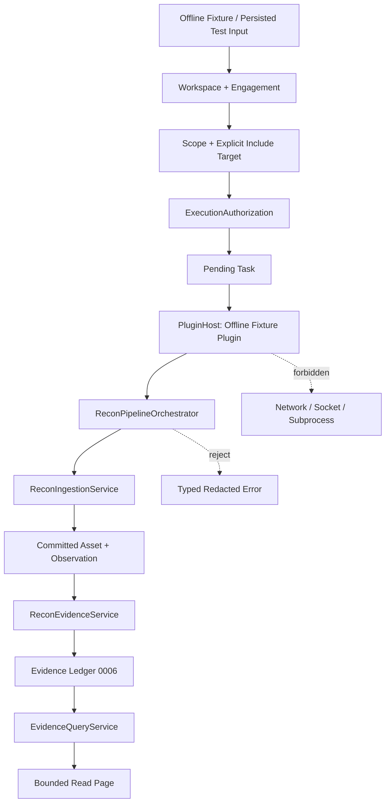

# Module 1.4 — Recon Evidence Query and Offline Web-Pentest Workflow

**Status:** Implemented and closed — Module 1.4  
**Baseline:** Module 0 closed; Module 1.0 closed; Module 1.1 closed at checkpoint `3ba4bf40`; Module 1.2 closed at checkpoint `e344411c`; Module 1.3 closed at checkpoint `b8b0eae6`  
**Migration:** None proposed or permitted in this slice  
**Security posture:** Read-only, fail-closed, scope-aware, privacy-first, no live side effects

> This document records the approved architecture and implementation for reading the Evidence Ledger and exercising an end-to-end offline Web-Pentest workflow with persisted or mock inputs. Module 1.4 does not add migrations, CLI commands, Web UI, network adapters, sockets, external subprocesses, or live reconnaissance.

## 1. Executive decision

Module 1.3 introduced a durable, provenance-bound Evidence Ledger. The next missing capability is not another scanner. It is a safe read boundary that can retrieve evidence for analysis and reporting without exposing SQL, SQLite rows, unbounded metadata, raw artifacts, or execution authority.

Module 1.4 therefore has two connected but deliberately separated concerns:

1. A **read-only Evidence Query boundary** that exposes bounded, deterministic, typed projections of `EvidenceRecord`.
2. An **Offline Web-Pentest Workflow boundary** that proves the complete domain flow from authorized Task creation through offline Pipeline execution, Recon ingestion, Evidence creation, and Evidence querying using fixture data only.

The workflow is a proof harness, not a scanner. Its purpose is to prove composition of the existing Modules 0–1.3 contracts before any real Web or network integration is considered.

## 2. Scope and non-goals

### 2.1 In scope

This slice designs a read-only application/query port for `EvidenceRecord`, immutable query and page DTOs, bounded keyset pagination, an allowlisted sort model, safe metadata projections, typed query errors, and a deterministic offline workflow scenario contract.

The design also defines the fixture lifecycle, fake-clock requirements, transaction boundaries, failure cases, security proofs, and acceptance criteria for a future implementation.

### 2.2 Explicitly out of scope

No implementation is authorized by this document. In particular, this slice must not add a database migration, alter `0006_recon_evidence.sql`, add a new table or index, write SQL in an application-facing API, add CLI or Web UI routes, introduce a new authorization model, start a subprocess, perform DNS/HTTP/socket activity, call a cloud or external API, invoke AI/LLM services, store raw artifacts, create Findings, generate reports, or integrate Nmap, Burp, Nuclei, Subfinder, httpx, or any live Web scanner.

The offline workflow must not call `TaskService.run()` if that path would invoke the real subprocess execution engine. It must use the already approved plugin host and pipeline contracts with deterministic offline fixture plugins.

## 3. Existing contracts and ownership

| Existing contract | Module 1.4 role | Forbidden change |
|---|---|---|
| `EvidenceRecord` | Authoritative persisted domain record | No mutation or alternate record shape |
| `SQLiteReconEvidenceRepository` | Existing write/archive adapter | No read API leakage of SQL or `sqlite3.Row` |
| `ReconEvidenceRepositoryPort` | Existing persistence boundary to extend only if approved | No breaking change to Module 1.3 methods |
| `ExecutionAuthorization` | Authorizes execution and remains the only execution authorization model | Query access must never manufacture or renew it |
| `Task` | Execution identity and lifecycle | Workflow must use the existing Task aggregate |
| `PluginHost` | Offline plugin boundary | No capability widening or arbitrary target selection |
| `ReconPipelineOrchestrator` | Executes deterministic fixture pipeline steps | No live adapters or subprocess route |
| `ReconIngestionService` | Converts committed fixture `ReconResult` into assets/observations | No direct SQL bypass |
| `ReconEvidenceService` | Creates evidence only from committed provenance | No evidence from uncommitted or synthetic parent rows |
| `SQLiteUnitOfWork` | Owns short persistence transactions | No transaction spanning the whole workflow |
| `OperationContext` | Correlation and redacted operational context | No credentials or raw payloads in errors/logs |

The query layer is an **application read boundary**, not a second persistence model. It may use a dedicated read port and read DTOs, but it must preserve the exact domain identities and provenance semantics established by Module 1.3.

## 4. Evidence Query architecture

### 4.1 Boundary shape

The proposed public contract is a read-only `EvidenceQueryService` over an `EvidenceQueryPort`. The service accepts an immutable `EvidenceQuery` and returns an immutable `EvidenceQueryPage` containing safe `EvidenceReadModel` projections.

```text
EvidenceQueryService
    ├── validates bounded filter and cursor
    ├── requires an explicit context root
    ├── applies read projection and metadata policy
    ├── delegates to EvidenceQueryPort
    └── translates failures to redacted typed errors

EvidenceQueryPort
    └── read-only persistence adapter
            └── SQLite read transaction
```

The service must not accept raw SQL, arbitrary column names, arbitrary `ORDER BY` strings, filesystem paths, URLs, raw query strings, or caller-defined joins. The adapter owns all SQL and returns domain/query DTOs only.

### 4.2 Query DTO

The proposed immutable query contract is:

```text
EvidenceQuery(
  scope_id: ScopeId | None,
  target_id: TargetId | None,
  task_id: TaskId | None,
  asset_id: AssetId | None,
  kind: EvidenceKind | None,
  status: EvidenceStatus | None,
  sort: EvidenceSort = COLLECTED_AT_DESC,
  limit: int = 50,
  cursor: EvidenceCursor | None = None,
  metadata_mode: MetadataMode = SUMMARY,
)
```

Every identifier is parsed as the existing UUID4 value object. Unknown `kind`, unknown `status`, malformed identifiers, negative limits, invalid cursor values, and unsupported sort values are rejected before persistence access.

### 4.3 Explicit filters

The query supports the following filters and no free-form predicates:

| Filter | Semantics | Boundary rule |
|---|---|---|
| `scope_id` | Restricts results to one Scope | Recommended and required for broad list queries |
| `target_id` | Restricts results to one Target | Must be compatible with `scope_id` when both exist |
| `task_id` | Restricts results to one Task execution | Parent scope/target consistency is revalidated |
| `asset_id` | Restricts results to one persisted Recon Asset | No arbitrary asset identity joins |
| `kind` | Exact match on closed `EvidenceKind` enum | No wildcard or substring matching |
| `status` | Exact match on `active` or `archived` | Default is `active`; archived requires explicit request |

The service must reject an unbounded query with no `scope_id`, `target_id`, `task_id`, or `asset_id`. This prevents accidental full-database reads and keeps the read surface aligned with the same context hierarchy as execution. A future access-control layer may add user/workspace policy, but Module 1.4 must not invent a second authorization model.

When multiple context filters are supplied, the service must validate their relationship before querying. A request for a `target_id` that is not inside the requested `scope_id`, or a `task_id` whose stored scope/target does not match the supplied context, returns a typed boundary error rather than an empty result that could conceal a caller mistake.

### 4.4 Read projections

The public query contract must not return SQLite rows, mapper internals, or an unrestricted `EvidenceRecord` object by default. The proposed projection is:

```text
EvidenceReadModel(
  id: EvidenceId,
  scope_id: ScopeId,
  target_id: TargetId,
  task_id: TaskId,
  asset_id: AssetId,
  observation_id: UUID | None,
  kind: EvidenceKind,
  title: str,
  content_digest: str,
  content_size_bytes: int,
  source_plugin_id: str,
  source_plugin_version: str,
  pipeline_id: str | None,
  pipeline_version: str | None,
  collected_at: datetime,
  status: EvidenceStatus,
  version: int,
  metadata: EvidenceMetadataView | None,
)
```

`EvidenceMetadataView` is a bounded, immutable, redacted projection. It contains only the already-approved JSON primitive values from Module 1.3. It does not contain raw plugin payloads, credentials, authorization references, raw query strings, filesystem paths, URLs, SQL fragments, or hidden database columns.

The default `metadata_mode` is `SUMMARY`, which omits metadata from every row. `SAFE_METADATA` may be requested explicitly and returns only allowlisted metadata after size and redaction validation. A future `FULL` mode is intentionally not defined in Module 1.4; absence of a mode is fail-closed, not permission to return the raw stored JSON.

### 4.5 Pagination

Pagination must use **keyset pagination**, not unbounded offset pagination. The default page size is 50 and the hard maximum is 200. A request with `limit > 200`, `limit <= 0`, or an implementation-defined oversized cursor is rejected.

The response contract is:

```text
EvidenceQueryPage(
  items: tuple[EvidenceReadModel, ...],
  next_cursor: EvidenceCursor | None,
  has_more: bool,
  returned: int,
)
```

`EvidenceCursor` is opaque to callers. Internally, it contains the last sort tuple, a normalized query fingerprint, and a cursor format version. The cursor must not contain raw SQL or metadata. The service rejects a cursor if it is malformed, expired by format policy, or reused with a different filter/sort/metadata query fingerprint.

The default stable order is `(collected_at DESC, id ASC)`. The final `id` tie-breaker is mandatory so that equal timestamps cannot duplicate or skip records between pages. A query with no next row returns `next_cursor = None` and `has_more = false`.

### 4.6 Sorting

Sorting is an enum, not caller-provided text. The initial allowlist is deliberately small:

| Sort enum | Stable SQL-equivalent order | Use case |
|---|---|---|
| `COLLECTED_AT_DESC` | `collected_at DESC, id ASC` | Operational chronology; default |
| `CREATED_AT_DESC` | `created_at DESC, id ASC` | Ledger insertion review |
| `KIND_ASC` | `kind ASC, collected_at DESC, id ASC` | Evidence classification review |
| `STATUS_ASC` | `status ASC, collected_at DESC, id ASC` | Active/archive review |

No sorting by metadata keys, digest fragments, arbitrary columns, or raw payload content is allowed in this slice.

## 5. Read security and error semantics

### 5.1 Authorization distinction

Evidence querying is not Task execution. A query must never create, renew, or reuse an `ExecutionAuthorization` as a read token. Conversely, a successful read must never imply permission to execute a Task.

The read boundary remains fail-closed through explicit context scoping, parent consistency checks, archived-status opt-in, and redacted typed errors. It must be designed so a future identity/access layer can be added without changing the query DTO or exposing a bypass around Scope and Target ownership.

### 5.2 Error contract

The proposed typed errors are:

| Error | Meaning | Public message policy |
|---|---|---|
| `EVIDENCE_QUERY_INVALID` | Malformed filter, enum, UUID, or metadata mode | Safe validation reason; no SQL |
| `EVIDENCE_QUERY_UNBOUNDED` | No explicit context root | Explain required scope/task/asset/target context |
| `EVIDENCE_QUERY_LIMIT_EXCEEDED` | Limit or projected metadata exceeds hard bound | Expose configured bound, not internal implementation |
| `EVIDENCE_QUERY_CURSOR_INVALID` | Cursor is malformed or query fingerprint differs | Do not expose cursor contents |
| `EVIDENCE_QUERY_CONTEXT_INVALID` | Parent IDs do not describe one context | Do not disclose unrelated records |
| `EVIDENCE_QUERY_STORAGE_FAILED` | Safe translation of SQLite/read adapter failure | Redacted generic storage message |

No query error may expose SQL statements, table/index names, filesystem paths, raw metadata, credentials, tracebacks, or unrelated record existence. Logging may include a correlation ID, normalized filter categories, returned count, and failure code, but not raw query values that are sensitive.

## 6. Offline Web-Pentest Workflow boundary

### 6.1 Purpose

The offline workflow is a deterministic composition test for the existing architecture. It should prove that the system can move from an explicitly authorized target to a persisted evidence query result without using a live scanner, network, subprocess, or external service.

It is not a Web scanner and must not claim that a fixture observation proves a live endpoint exists. Fixture data must be labelled as offline/synthetic in the scenario metadata and in any resulting evidence title or metadata.

### 6.2 Proposed scenario contract

```text
OfflineWebPentestScenario(
  scenario_id: str,
  fixture_version: str,
  workspace_spec: WorkspaceFixture,
  engagement_spec: EngagementFixture,
  scope_spec: ScopeFixture,
  target_spec: TargetFixture,
  pipeline_definition: PipelineDefinition,
  expected_evidence: tuple[ExpectedEvidence, ...],
  clock: FixedClock,
)
```

The scenario is a test/application contract, not a persisted production entity. It is loaded from an in-memory or local test fixture controlled by the test suite. It must not accept arbitrary network locations, shell commands, plugin paths, or external object references.

### 6.3 End-to-end flow



The required sequence is:

1. Create Workspace, Engagement, Scope, and an explicit Include Target using existing domain contracts.
2. Authorize the Scope with a fixed, non-expired clock and obtain the existing `ExecutionAuthorization`.
3. Create a pending Task bound to that authorization and target. The Task carries the existing execution specification, but the offline fixture plugin must not invoke it through the subprocess engine.
4. Register only the deterministic offline fixture plugin and execute a one- or two-step `PipelineDefinition` through the existing `ReconPipelineOrchestrator`.
5. Persist the resulting assets and observations through `ReconIngestionService` using the existing per-step atomic boundary.
6. Create Evidence through `ReconEvidenceService` only after the asset and observation are committed.
7. Query the evidence through the proposed read-only query service with explicit `scope_id`, bounded pagination, and safe metadata mode.
8. Compare the returned projections with `expected_evidence`, including provenance IDs, digest, status, ordering, and fixture marker.

The scenario must use a fixed clock injected into every time-sensitive service. It must not depend on the wall clock and must include a test where authorization expires between ingestion and evidence creation. That test must fail closed without deleting the previously committed observation.

### 6.4 Fixture policy

Fixtures may contain structured observations such as a synthetic subdomain, a synthetic service record, or a synthetic HTTP metadata record. They must be deterministic, minimal, and clearly marked as offline. They may not contain live URLs to fetch, shell commands, DNS names to resolve, credentials, API tokens, raw HTTP requests, or raw response bodies.

The fixture plugin may generate a `ReconResult`, but it may not create or modify authorization, select a target, widen Scope, increase Task limits, write Evidence directly, or access the filesystem/network. Evidence remains the responsibility of `ReconEvidenceService`.

### 6.5 Failure and rollback semantics

The workflow must prove that a failure before Pipeline ingestion creates no asset, observation, or evidence row. A failure after one committed Pipeline step preserves that committed step but does not create evidence for an uncommitted step. A cancellation before ingestion leaves no partial result for that step. A cross-scope, excluded-target, expired-authorization, or mismatched-parent scenario returns a typed redacted failure and performs no unauthorized write.

The final query stage is read-only. A malformed query or invalid cursor cannot mutate the database, change Task state, archive Evidence, or retry the workflow.

## 7. Transaction and performance boundaries

The query operation uses a short read transaction and must not hold a write lock. It returns at most 200 rows and a bounded metadata projection per row. The workflow keeps the existing Module 1.2 rule of one short UnitOfWork per committed ingestion/evidence operation; it never wraps Workspace setup, Pipeline execution, ingestion, evidence creation, and query retrieval in one long transaction.

No performance claim is made for real-scale data in this design-only slice. The implementation must measure query count, returned row count, metadata bytes, and cursor traversal in tests without introducing premature caching or a new search engine.

## 8. Test and verification strategy

The future implementation must add tests without modifying the closed-module behavior:

| Test family | Required proof |
|---|---|
| Query validation | Every filter, enum, UUID, limit, sort, and metadata mode is validated |
| Bounded reads | Default and hard-max limits are enforced; unbounded queries fail closed |
| Context consistency | Scope/Target/Task/Asset combinations cannot cross boundaries |
| Projection safety | No SQL rows, raw payloads, credentials, paths, or hidden columns escape |
| Pagination | Keyset cursor is stable, deterministic, query-bound, and rejects tampering |
| Sorting | Only allowlisted stable sort orders are accepted |
| Status policy | Active is default; archived requires explicit status/filter intent |
| Metadata policy | Summary omits metadata; safe mode returns bounded redacted metadata only |
| Read immutability | Queries never mutate rows, versions, Task state, or archive status |
| Offline happy path | Task → Pipeline → Asset/Observation → Evidence → Query succeeds deterministically |
| Offline negative paths | Expired, excluded, cross-target, cancellation, partial failure, and invalid query fail closed |
| No-side-effect boundary | No network, socket, DNS, subprocess, external API, AI/LLM, or live scanner |
| Regression | All existing Module 0–1.3 tests remain green |

The static boundary scan must inspect only the new Module 1.4 implementation and test files. It must avoid false positives from legitimate migration/test vocabulary while still rejecting forbidden imports and APIs.

## 9. Decisions requiring explicit approval

| Decision | Proposed choice | Why it matters |
|---|---|---|
| Query boundary | Dedicated read-only `EvidenceQueryService` and `EvidenceQueryPort` | Prevents read callers from receiving SQL/rows or mutation methods |
| Query scope | Require at least one explicit context root; reject global unbounded reads | Preserves fail-closed context isolation |
| Projection | `EvidenceReadModel` with metadata omitted by default | Prevents accidental raw metadata exposure |
| Pagination | Keyset pagination with opaque query-bound cursor; default 50, hard max 200 | Provides bounded deterministic reads without unbounded offsets |
| Sorting | Four allowlisted stable enum orders with `id` tie-breaker | Prevents arbitrary SQL/order injection and unstable pages |
| Archived evidence | Active-only by default; archived requires explicit status | Makes retention state visible and deliberate |
| Authorization | Reuse existing execution authorization semantics for workflow; do not create a read authorization model | Avoids a second competing authorization system |
| Offline workflow | Deterministic fixture plugin and persisted local inputs only | Proves composition without live Web activity |
| Persistence | Zero new migrations and no schema changes | Keeps Module 1.4 read/workflow design additive |

## 10. Implementation record and closure

The approved design was implemented through `src/cyberos/domain/recon/evidence_query.py`, `src/cyberos/persistence/evidence_query_repository.py`, `src/cyberos/application/recon_evidence_query.py`, and `src/cyberos/application/offline_web_pentest.py`. The read boundary uses immutable query/page/projection DTOs, static allowlisted SQL, explicit context-root validation, active-only defaults, safe metadata modes, opaque query-bound cursors, four stable sort enums, and redacted typed errors. No schema or migration was added.

`OfflineWebPentestHarness` composes the existing Workspace, Engagement, Scope, Target, ExecutionAuthorization, Task, PluginHost, ReconPipelineOrchestrator, ReconIngestionService, ReconEvidenceService, and EvidenceQueryService contracts. Its fixture plugin is deterministic and in-process; it performs no network, socket, subprocess, filesystem, external API, or live scanner activity. The test matrix proves the happy path and typed negative path without creating Evidence after fixture failure.

The implementation added **7 tests**, bringing the complete regression suite to **335 passing tests**. `bash scripts/check.sh` passed pytest, Ruff check, Ruff format check, `mypy --strict`, and wheel build. The final boundary scan passed with no network/DNS/HTTP/socket/subprocess/external API/AI/LLM/live scanner side effects and no migration beyond `0006`.

Module 1.4 is closed at this boundary. Future work must begin with a separately reviewed architecture slice and must not reopen Modules 0–1.3 without a documented regression or architectural contradiction.

## Internal references

1. Module 1.3 design and Evidence Ledger: `cyberos-core/docs/architecture/module-1-3-recon-evidence-provenance-design.md`.
2. Module 1.2 orchestration design: `cyberos-core/docs/architecture/module-1-2-recon-orchestration-design.md`.
3. Recon ingestion boundary: `cyberos-core/src/cyberos/application/recon_ingestion.py`.
4. Evidence persistence boundary: `cyberos-core/src/cyberos/persistence/recon_evidence_repository.py`.
5. Current project roadmap: `/home/ubuntu/upload/roadmap2.html`.
