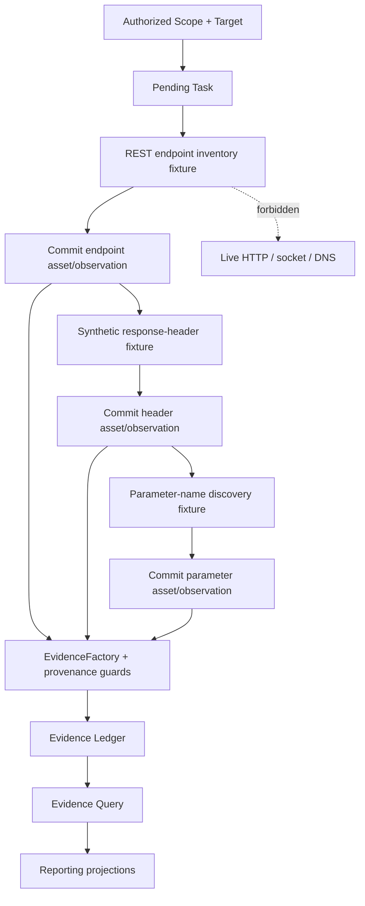

# Module 1.5 — Recon Reporting and Web API Offline Fixtures

**Status:** Implemented and closed — Module 1.5  
**Baseline:** Module 0 closed; Module 1.0 closed; Module 1.1 closed at checkpoint `3ba4bf40`; Module 1.2 closed at checkpoint `e344411c`; Module 1.3 closed at checkpoint `b8b0eae6`; Module 1.4 closed at checkpoint `fd07a836`  
**Migration:** None proposed or permitted in this slice  
**Security posture:** Read-only, bounded, fail-closed, context-isolated, synthetic fixtures only

> This document records the approved architecture and implementation for immutable Recon reporting projections and deterministic multi-step Web API fixtures. It adds no migrations, live HTTP, sockets, DNS, external subprocesses, external APIs, Web routes, CLI commands, raw artifact storage, Findings, or vulnerability scoring.

## 1. Executive decision

Module 1.4 established two stable boundaries: a bounded, read-only `EvidenceQueryService` and a deterministic offline Web workflow harness. The next capability should make those results useful for analysis and academic or operational review without introducing mutable report state or live Web behavior.

Module 1.5 therefore has two deliberately separated concerns:

1. **Read-only reporting projections** that summarize already committed Recon Assets, Observations, Evidence, Tasks, Plugins, Pipelines, and provenance relationships.
2. **Multi-Web API offline fixtures** that exercise a realistic sequence of synthetic REST endpoint, response-header, and parameter-discovery steps through the existing authorization, Task, Pipeline, ingestion, Evidence, and Query contracts.

The reporting layer is a projection, not a second database. The fixture layer is a proof harness, not a Web scanner. Neither layer may infer live facts from synthetic data.

## 2. Scope and non-goals

### 2.1 In scope

This design defines immutable report DTOs, a read-only reporting service, bounded aggregation rules, projection-source composition, metadata and redaction policies, typed reporting errors, and deterministic report consistency semantics.

It also defines a `MultiWebApiOfflineScenario` contract with closed step kinds for synthetic REST endpoints, HTTP headers, and parameter discovery; fixture input/output rules; step dependencies; labels; failure and cancellation behavior; and a test matrix that proves end-to-end composition.

### 2.2 Explicitly out of scope

No migration, SQL schema change, new index, write-side reporting state, report file generation, Web UI, HTTP server, live HTTP request, socket, DNS lookup, external subprocess, cloud API, AI/LLM call, Nmap, Burp, Nuclei, Subfinder, httpx, browser automation, Findings, vulnerability scoring, exploit logic, or raw HTTP request/response storage is authorized by this module.

The word **Web API** in this module means a synthetic fixture domain model and workflow scenario. It does not authorize an API client, network adapter, URL fetch, or real endpoint validation.

## 3. Existing contracts and ownership

| Existing contract | Module 1.5 role | Forbidden change |
|---|---|---|
| `EvidenceQueryService` | Source of bounded, typed Evidence projections | No SQL or `sqlite3.Row` access from reporting |
| `EvidenceQueryPort` | Optional internal source behind the query service | No arbitrary predicates or mutable reporting state |
| `EvidenceReadModel` | Safe per-record input to aggregations | No raw metadata or hidden columns |
| `ReconRepositoryPort` | Source for bounded Asset/Observation summaries where required | No new correlation rules or write behavior |
| `ReconPipelineOrchestrator` | Executes the synthetic multi-step workflow | No live plugin route or subprocess invocation |
| `PluginHost` | Deny-by-default fixture plugin boundary | No capability widening or arbitrary target selection |
| `ReconIngestionService` | Commits synthetic structured observations | No direct SQL bypass |
| `ReconEvidenceService` | Creates provenance-bound evidence after commit | No Evidence from uncommitted fixture parents |
| `ExecutionAuthorization` | Sole execution authorization model | No reporting token or fixture authorization model |
| `Task` | Sole execution identity and lifecycle | No synthetic Task replacement |
| `EvidenceQueryCursor` | Bounded source traversal | No unbounded pagination or offset scan |
| `SQLiteUnitOfWork` | Short read/write transactions at existing boundaries | No transaction spanning an entire report/workflow |

Reporting must consume **read boundaries**, not repositories by reaching through their internals. If a projection needs a source that Module 1.4 does not expose, the design permits an additive read-only port or service contract only after explicit review; it does not permit raw SQL in the reporting layer.

## 4. Reporting projection architecture

### 4.1 Boundary shape

The proposed application boundary is `ReconReportingService`. It receives a typed report request and returns one immutable projection. It composes read-only source ports and delegates Evidence traversal to the existing `EvidenceQueryService` contract.

```text
ReconReportingService
    ├── validates context and report budget
    ├── requests bounded EvidenceReadModel pages
    ├── requests bounded Asset/Observation read projections
    ├── aggregates in memory with fixed-size counters/sets
    ├── applies redaction and synthetic-label policy
    └── returns an immutable report projection

EvidenceQueryService ───────┐
ReconAssetReadPort ─────────┼──> Reporting projection DTO
ReconTaskReadPort (optional)┘
```

The service must never persist a report snapshot, cache mutable aggregate state, modify Evidence status, archive records, update Task state, or create an authorization. Every invocation is a read operation over a bounded, deterministic source window.

### 4.2 Common report context

All report requests must carry an explicit context root and a report budget:

```text
ReconReportContext(
  scope_id: ScopeId,
  target_id: TargetId | None,
  task_id: TaskId | None,
)

ReconReportBudget(
  max_evidence_records: int = 2_000,
  max_assets: int = 2_000,
  max_observations: int = 5_000,
  max_metadata_bytes: int = 65_536,
  max_pages: int = 100,
)
```

The context must be validated using the existing Scope/Target/Task parent relationships. A target or task outside the requested Scope is a typed context error, not an empty report. A request without `scope_id` is rejected even if a task or target is supplied; reports are intentionally rooted at Scope to prevent accidental cross-engagement aggregation.

The budget is fail-closed. If the projection would exceed a bound, the service returns `REPORT_BUDGET_EXCEEDED` and does not silently truncate, approximate, or label a partial report as complete. A future explicit partial-report mode is deferred.

## 5. Reporting projections

### 5.1 `TargetReconSummary`

This projection is the bounded operational summary for one authorized Scope and optional Target:

```text
TargetReconSummary(
  scope_id: ScopeId,
  target_id: TargetId | None,
  generated_at: datetime,
  source_window: ReportSourceWindow,
  asset_count: int,
  observation_count: int,
  active_evidence_count: int,
  archived_evidence_count: int,
  evidence_by_kind: Mapping[EvidenceKind, int],
  assets_by_kind: Mapping[AssetKind, int],
  source_plugins: tuple[PluginSourceSummary, ...],
  pipelines: tuple[PipelineSourceSummary, ...],
  provenance: ProvenanceAuditSummary,
  synthetic_fixture_only: bool,
)
```

The summary contains counts and allowlisted identities only. It does not contain evidence metadata, raw observation values, raw target strings, request headers, query parameters, credentials, or payload bodies. If all contributing records are fixture-labelled, `synthetic_fixture_only` is true; otherwise it is false. The field is descriptive and never represents a security decision.

### 5.2 `AssetDistributionBreakdown`

This projection supports analysis of the shape of the committed Recon inventory:

```text
AssetDistributionBreakdown(
  scope_id: ScopeId,
  target_id: TargetId | None,
  generated_at: datetime,
  total_assets: int,
  by_kind: tuple[AssetKindDistribution, ...],
  by_status: tuple[AssetStatusDistribution, ...],
  observed_asset_count: int,
  evidence_linked_asset_count: int,
  unlinked_asset_count: int,
  source_window: ReportSourceWindow,
)
```

`by_kind` and `by_status` are sorted by a fixed enum order followed by descending count and canonical enum value. No sorting by metadata or caller-provided text is allowed. A linked asset means that at least one committed Evidence projection in the same context references it; the report must not infer linkage from names, target strings, timestamps, or plugin-provided arbitrary IDs.

### 5.3 `ProvenanceAuditSummary`

This projection is designed for audit and academic defense of the provenance chain:

```text
ProvenanceAuditSummary(
  total_evidence: int,
  active_evidence: int,
  archived_evidence: int,
  distinct_task_count: int,
  distinct_asset_count: int,
  distinct_observation_count: int,
  distinct_plugin_count: int,
  distinct_pipeline_count: int,
  cross_context_violation_count: int,
  missing_parent_count: int,
  synthetic_record_count: int,
  redaction_applied: bool,
)
```

For a healthy committed data source, `cross_context_violation_count` and `missing_parent_count` are zero because the existing foreign keys and provenance guards prevent those rows from being created. The projection reports zero as a verified result; it must not perform an unsafe best-effort scan that bypasses the existing boundaries. If a source adapter detects an integrity inconsistency, the service returns `REPORT_DATA_INCONSISTENT` rather than publishing a misleading summary.

### 5.4 Shared projection rules

All report DTOs are frozen and contain tuples or immutable mappings. They carry `generated_at` from an injected clock in tests and UTC in production. They expose source-window counts and budget status so a consumer can distinguish a complete report from a failed request; they never expose internal SQL, cursor encoding, repository classes, or row objects.

Metadata is omitted from all report projections by default. The only permitted metadata-derived fields are explicitly allowlisted boolean markers such as `offline_fixture` and bounded categorical values such as plugin or pipeline identifiers. Restricted values, raw query strings, authorization headers, cookies, credentials, arbitrary paths, URLs, and body content are rejected or redacted before aggregation.

## 6. Reporting query and aggregation semantics

### 6.1 Source traversal

The reporting service must use the existing bounded Evidence query contract. It may traverse pages using the query-bound opaque cursor, but it must stop at `max_pages` and `max_evidence_records`. If another page exists beyond the budget, the service fails closed with `REPORT_BUDGET_EXCEEDED`; it must not present the first page as a complete report.

Asset and Observation inputs must come from an approved read-only projection port or service. The report layer may not call `raw.execute`, construct SQL, inspect SQLite rows, or access mapper internals. No report requires a new table or index in Module 1.5.

### 6.2 Deterministic aggregation

Aggregation is deterministic for a fixed database state, query context, budget, and clock. Counts use integer counters. Distinct identities use bounded UUID sets. Distributions use closed enum keys initialized in a fixed order. Plugin and pipeline source summaries are sorted by stable identity and version. The report has no random IDs and no wall-clock-dependent ordering beyond the explicit `generated_at` field.

### 6.3 Completeness and consistency

The report must carry a `ReportSourceWindow` describing query context, pages read, records read, and budget used. It must not call a bounded partial read a complete report. If a source changes during report generation and the read boundary cannot guarantee a consistent view, the implementation must either use the existing short read transaction semantics for one projection source or return `REPORT_DATA_INCONSISTENT`; it must not merge silently inconsistent windows.

## 7. Multi-Web API offline fixture architecture

### 7.1 Purpose and labels

The multi-step fixture expands the Module 1.4 proof from one synthetic observation to a small Web API workflow. It models endpoint inventory, safe synthetic response headers, and parameter-name discovery. Each output is labelled with `offline_fixture=true`, `synthetic=true`, `scenario_id`, `fixture_version`, and `step_id` before it reaches Evidence creation.

The label is part of the fixture contract and is not optional. Reports must preserve the distinction between synthetic fixture data and future real Recon data. No fixture result may be described as a live endpoint, verified header, or discovered production parameter.

### 7.2 Closed fixture vocabulary

```text
OfflineWebApiStepKind:
  REST_ENDPOINT_INVENTORY
  SYNTHETIC_RESPONSE_HEADERS
  PARAMETER_NAME_DISCOVERY
```

The scenario contract is:

```text
MultiWebApiOfflineScenario(
  scenario_id: str,
  fixture_version: str,
  context: OfflineScenarioContext,
  steps: tuple[OfflineWebApiStep, ...],
  expected_outputs: tuple[ExpectedFixtureOutput, ...],
  clock: FixedClock,
)
```

Each `OfflineWebApiStep` contains a closed step kind, stable step ID, declared input asset kinds, bounded synthetic parameters, and the expected output kind. It does not contain a URL, socket address, shell command, plugin path, authorization header, cookie, token, raw request, or raw response body.

### 7.3 Fixture input/output contracts

The REST endpoint fixture may contain a synthetic route such as `/api/v1/items`, an HTTP method from the closed set `GET`, `POST`, `PUT`, or `DELETE`, and a bounded label. It produces a structured endpoint observation with route digest, method, synthetic status class, and fixture markers. It must not imply that the route exists on a real host.

The response-header fixture may contain an allowlisted set of synthetic header names such as `content-type`, `server-family`, `cache-control`, and `x-fixture-id`. Values are bounded and deterministic. `Authorization`, `Cookie`, `Set-Cookie`, proxy credentials, bearer material, and arbitrary security-sensitive headers are forbidden even in fixtures. A header digest may be stored; a raw header block may not be stored.

The parameter-discovery fixture may contain parameter names and locations from the closed set `query`, `path`, or `json_body`. It must never contain parameter values, secrets, tokens, or a raw request body. The output is a structured name/location observation with the synthetic marker.

### 7.4 Step dependencies and pipeline flow

The recommended fixture pipeline is:



Each step is target-bound and receives only the committed, same-context assets allowed by `PipelineInputResolver`. A later step cannot select an arbitrary asset by raw value or plugin ID. The orchestrator preserves Module 1.2 per-step atomic ingestion, cancel-before-ingest, and fail-closed budget rules.

### 7.5 Fixture failure semantics

The workflow must cover the following deterministic outcomes:

| Scenario | Expected behavior |
|---|---|
| All three steps succeed | Three synthetic observations are committed, Evidence is created, and reports are queryable |
| Header fixture fails | Endpoint step remains committed; header and later steps create no uncommitted Evidence |
| Parameter fixture is cancelled before ingest | Earlier committed steps remain; parameter output is rejected before ingestion |
| Scope is expired | Task/workflow creation is rejected before fixture execution |
| Target is excluded | Authorization fails closed; no Task or fixture output is created |
| Cross-target input is injected | `PipelineInputResolver` or provenance guard returns a typed rejection |
| Fixture metadata contains a secret/control character | Fixture validation rejects it without persistence |
| Report budget is exceeded | Reporting returns a typed budget error; no partial report is published |

No automatic retry is introduced. A safe replay of a committed fixture step relies on existing deterministic plugin behavior and Module 1.1/1.3 idempotency; a changed fixture digest creates a new structured record and preserves prior provenance.

## 8. Security and privacy boundaries

| Boundary | Required enforcement |
|---|---|
| Context | Every report and fixture scenario is rooted in one Scope and optionally one compatible Target/Task |
| Authorization | Existing `ExecutionAuthorization` is checked for workflow execution; reporting never creates or renews it |
| Projection | Reports contain counts, enums, stable IDs, digests, and allowlisted source summaries only |
| Metadata | Synthetic markers and bounded categories are allowed; secrets, credentials, raw queries, paths, URLs, and bodies are rejected |
| Fixture transport | In-process deterministic plugin calls only; no HTTP client, socket, DNS, or subprocess |
| Limits | Page, record, metadata, asset, observation, and step budgets fail closed without truncation |
| Provenance | Every synthetic output must reference the same committed Task/Scope/Target and prior step context |
| Errors | Typed and redacted; no SQL, stack traces, raw headers, raw body, or sensitive values |
| State | Reporting is read-only; fixture writes use existing Task/Pipeline/Ingestion/Evidence boundaries |
| Labels | Synthetic/offline markers remain visible in Evidence and report projections |

## 9. Proposed typed errors

The implementation may add typed error codes only after approval. The proposed codes are:

| Error code | Meaning | Redaction rule |
|---|---|---|
| `REPORT_QUERY_INVALID` | Invalid report context, projection option, or filter | Return safe field-level validation only |
| `REPORT_BUDGET_EXCEEDED` | Bounded aggregation would require more data | Expose configured category and bound, not raw rows |
| `REPORT_DATA_INCONSISTENT` | Source projections do not share a valid context/window | Do not disclose unrelated record existence |
| `REPORT_PROJECTION_INVALID` | Internal projection invariant failed | Return generic projection failure with correlation ID |
| `OFFLINE_FIXTURE_INVALID` | Step, header, route, parameter, or label violates fixture contract | Never echo restricted fixture value |
| `OFFLINE_FIXTURE_EXECUTION_FAILED` | Deterministic fixture step returned a controlled failure | Return typed step ID/category, not raw payload |
| `OFFLINE_FIXTURE_CONTEXT_INVALID` | Fixture input is cross-scope, cross-target, or not committed | Return generic provenance rejection |

Existing `CyberOSError` behavior remains the outer error boundary. No `sqlite3.Error`, traceback, raw SQL, raw HTTP fixture content, or credential can escape.

## 10. Test and verification strategy

The future implementation must add tests without changing Modules 0–1.4:

| Test family | Required proof |
|---|---|
| Projection validation | Immutable DTOs, UTC timestamps, fixed enum ordering, bounded counters, and source-window invariants |
| Target summary | Correct asset/evidence/plugin/pipeline counts for one Scope and Target |
| Distribution | Deterministic by-kind/by-status order and linked/unlinked asset calculation |
| Provenance audit | Distinct IDs and zero-violation proof from valid read boundaries |
| Reporting budget | Max rows/pages/metadata fail closed without silent truncation |
| Read isolation | Cross-scope, cross-target, and cross-task reports are typed failures |
| Redaction | No metadata secrets, raw headers, raw bodies, parameter values, SQL, or traceback leakage |
| REST fixture | Synthetic endpoint output is deterministic and explicitly labelled |
| Header fixture | Allowlisted headers work; cookies/auth/security-sensitive values are rejected |
| Parameter fixture | Names and locations work; values and raw bodies are rejected |
| Chaining | Endpoint → headers → parameters receives only same-context committed assets |
| Partial failure | Earlier committed step survives; failed/uncommitted later step is absent |
| Cancellation | Cancel-before-ingest prevents the pending step from persisting |
| Authorization | Expired, excluded, mismatched, and cross-target scenarios fail closed |
| No-side-effect boundary | No network, socket, DNS, subprocess, external API, live scanner, or AI/LLM |
| Regression | All existing 335 tests remain green |

The boundary scan must inspect only the new Module 1.5 implementation and fixture test files. It must use precise forbidden-API patterns and avoid false positives from words such as `http` in synthetic type names or documentation.

## 11. Approved decisions and implementation status

| Decision | Proposed choice | Why it matters |
|---|---|---|
| Reporting boundary | Dedicated read-only `ReconReportingService` over existing query/read ports | Prevents mutable report state and SQL leakage |
| Projection set | `TargetReconSummary`, `AssetDistributionBreakdown`, `ProvenanceAuditSummary` | Covers operational, inventory, and audit views without Findings/report generation |
| Context root | Scope is mandatory; Target/Task are optional compatible refinements | Prevents cross-engagement aggregation |
| Aggregation | Bounded in-memory counters/sets with fail-closed budgets | Avoids unbounded memory and silent incomplete reports |
| Completeness | Budget overflow or inconsistent source window is an error, not a partial success | Preserves audit honesty |
| Metadata | Summary projections omit metadata; only allowlisted categories/markers survive | Prevents sensitive data leakage |
| Fixture vocabulary | Closed REST endpoint, synthetic response headers, and parameter-name discovery steps | Proves Web API composition without live Web behavior |
| Fixture labels | Every output carries `offline_fixture=true`, `synthetic=true`, scenario, version, and step IDs | Prevents synthetic data being mistaken for live evidence |
| Header policy | Allowlisted safe synthetic headers only; no auth/cookie/raw header block | Establishes privacy-first fixture boundary |
| Parameter policy | Names and locations only; no values or raw bodies | Avoids accidental secret storage |
| Persistence | Zero new migrations and no reporting tables/state | Keeps Module 1.5 additive and read-oriented |

## 12. Implementation record and closure

The approved design was implemented through `src/cyberos/domain/recon/reporting.py`, `src/cyberos/persistence/recon_reporting_source.py`, `src/cyberos/application/recon_reporting.py`, `src/cyberos/application/offline_web_api.py`, and `tests/integration/test_recon_reporting_and_web_api.py`. The implementation provides immutable reporting DTOs, Scope-rooted context validation, bounded asset/evidence/metadata/page budgets, deterministic Target/Asset/Provenance projections, and typed redacted reporting errors.

`MultiWebApiOfflineHarness` composes the existing Task, PluginHost, Pipeline, Ingestion, Evidence Ledger, Query, and Reporting boundaries. Its closed fixture vocabulary covers REST endpoint inventory, synthetic safe response headers, and parameter names/locations only. The happy path, synthetic labels, header allowlist, parameter privacy, budget overflow, partial failure, cancel-before-ingest, and context isolation are covered by the new integration matrix.

The complete suite finished with **341 passing tests**. `bash scripts/check.sh` passed pytest, Ruff check, Ruff format check, `mypy --strict`, and wheel build. The final boundary scan passed with no network/socket/DNS/HTTP client, subprocess, external API, AI/LLM, live scanner, raw artifact, or migration beyond `0006` side effects.

Module 1.5 is closed at this boundary. Future work must begin with a separately reviewed architecture slice and must not reopen Modules 0–1.4 without a documented regression or architectural contradiction.

## Internal references

1. Module 1.4 query and offline workflow design: `cyberos-core/docs/architecture/module-1-4-recon-evidence-query-and-offline-workflow-design.md`.
2. Module 1.3 Evidence and provenance design: `cyberos-core/docs/architecture/module-1-3-recon-evidence-provenance-design.md`.
3. Module 1.2 pipeline orchestration design: `cyberos-core/docs/architecture/module-1-2-recon-orchestration-design.md`.
4. Current project roadmap: `/home/ubuntu/upload/roadmap2.html`.
