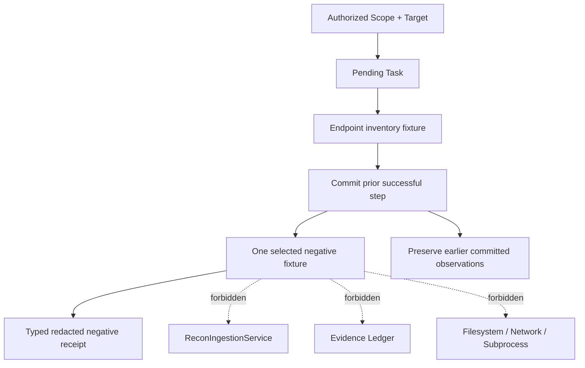

# Module 1.6 — Recon Reporting Export and Negative Offline Fixtures

**Status:** Implemented and closed — Module 1.6  
**Baseline:** Module 0 closed; Module 1.0 closed; Module 1.1 closed at checkpoint `3ba4bf40`; Module 1.2 closed at checkpoint `e344411c`; Module 1.3 closed at checkpoint `b8b0eae6`; Module 1.4 closed at checkpoint `fd07a836`; Module 1.5 closed at checkpoint `70486778`  
**Migration:** None proposed or permitted in this slice  
**Security posture:** Read-only, scope-rooted, redacted, bounded, fail-closed, synthetic fixtures only

> This document records the approved architecture and implementation for in-memory reporting export projections and deterministic negative Web API fixtures. It adds no filesystem exporter, report renderer, database migration, live HTTP, sockets, DNS, external subprocesses, external APIs, browser automation, or unredacted payload storage.

## 1. Executive decision

Module 1.5 introduced immutable reporting projections and a deterministic three-step synthetic Web API workflow. The next useful capability is to make those projections consumable by an export boundary while proving that negative Web API conditions fail safely rather than being mistaken for successful reconnaissance.

Module 1.6 therefore has two connected but separately governed concerns:

1. **Read-only export projections** that compose the existing `TargetReconSummary`, `AssetDistributionBreakdown`, and `ProvenanceAuditSummary` into an immutable, canonical JSON DTO and a renderer-neutral structured presentation model.
2. **Negative and edge-case offline fixtures** that model rate limiting, authentication and authorization rejection, unexpected payload shapes, and parameter-boundary failures entirely in-process and deterministically.

The export is a serialization boundary, not a file writer. The negative fixture is a controlled failure proof, not a scanner and not evidence that a real endpoint behaved in a particular way.

## 2. Scope and non-goals

### 2.1 In scope

This design defines an immutable `ReconReportSnapshot`, a context-rooted `ReconReportJsonExport`, a renderer-neutral `StructuredSummaryPresentation`, canonical JSON and digest rules, bounded export-size validation, redaction and integrity semantics, and typed export errors.

It also defines a closed vocabulary for negative Web API fixture outcomes, deterministic scenario contracts, validation rules, failure receipts, expected state transitions, and test requirements for synthetic HTTP status 429, status 401/403, unexpected payload shapes, and parameter-boundary violations.

### 2.2 Explicitly out of scope

No filesystem export, file creation, temporary file, PDF/HTML/Markdown renderer, archive/ZIP output, upload, Web API route, HTTP client, socket, DNS lookup, external subprocess, cloud call, AI/LLM call, live scanner, retry daemon, credential handling, raw request or response body, vulnerability finding, severity score, exploit action, or database migration is authorized by this module.

The JSON export is an in-memory `str`/bytes value returned to a caller. It must not write itself to disk, accept a path, create directories, open a file, or invoke a renderer. The word **HTTP** in fixture names denotes a synthetic status and structured marker only.

## 3. Existing contracts and ownership

| Existing contract | Module 1.6 role | Forbidden change |
|---|---|---|
| `TargetReconSummary` | Primary operational summary source | No recomputation from repositories or raw rows |
| `AssetDistributionBreakdown` | Primary asset inventory source | No new asset joins or mutable report state |
| `ProvenanceAuditSummary` | Primary audit/provenance source | No bypass of Module 1.3 provenance guards |
| `ReconReportingService` | Produces the bounded projections used by export | No SQL, mapper, or SQLite access in export |
| `EvidenceQueryService` | Indirectly supplies Module 1.5 projections | Export must not query Evidence directly |
| `MultiWebApiOfflineScenario` | Base scenario for negative extensions | No replacement workflow or live transport |
| `PluginHost` and `ReconPipelineOrchestrator` | Execute controlled fixture failures | No capability widening, retry, or subprocess path |
| `ReconIngestionService` | Receives only successful fixture outputs | Negative outcomes must not create unauthorized rows |
| `ReconEvidenceService` | Receives only committed provenance | Negative fixture receipts do not create Evidence |
| `ExecutionAuthorization` | Sole workflow execution authorization | Export never creates, renews, or reuses it as a read token |
| `Task` | Sole workflow execution identity | No synthetic Task replacement |
| `OperationContext` | Correlation and redacted error context | No raw fixture values or payload leakage |

Module 1.6 consumes Module 1.5 projections at their public read boundary. It must not reach through `ReconReportingService` into `SQLiteReconRepository`, `sqlite3.Row`, SQL statements, or Evidence mapper internals.

## 4. Read-only export architecture

### 4.1 Boundary shape

The proposed application boundary is `ReconReportingExportService`. It accepts an immutable export request and an already-built, context-validated reporting snapshot. It returns either an immutable JSON export DTO or a renderer-neutral presentation model. It performs no persistence and has no filesystem dependency.

```text
ReconReportingService
    ├── TargetReconSummary
    ├── AssetDistributionBreakdown
    └── ProvenanceAuditSummary
              │
              ▼
      ReconReportSnapshot
              │
              ├── ReconReportingExportService ──> ReconReportJsonExport
              └── SummaryPresentationService ───> StructuredSummaryPresentation

Forbidden from every export path:
filesystem · renderer · upload · network · SQL · mutation · raw payload
```

The snapshot is an in-memory composition object, not a persisted report. The export service may validate that all three projections share the same Scope context, compatible Target context, UTC generation instant, and source-window identity. A mismatch returns a typed integrity error; it is never silently merged.

### 4.2 Scope-rooted export request

Every export request must contain `scope_id`. Optional `target_id` and `task_id` refinements must match the snapshot exactly. There is no global export and no export request that derives context from an arbitrary report field.

```text
ReconReportExportRequest(
  scope_id: ScopeId,
  target_id: TargetId | None,
  task_id: TaskId | None,
  export_kind: ExportKind,
  max_export_bytes: int = 262_144,
)
```

The initial `ExportKind` allowlist contains only `JSON` and `STRUCTURED_SUMMARY`. A caller cannot provide a filename, path, MIME type, template, renderer name, compression option, or destination. `max_export_bytes` is bounded by a hard implementation ceiling and rejects non-positive or oversized values before serialization.

### 4.3 `ReconReportSnapshot`

The snapshot is immutable and is composed directly from Module 1.5 projections:

```text
ReconReportSnapshot(
  scope_id: ScopeId,
  target_id: TargetId | None,
  task_id: TaskId | None,
  generated_at: datetime,
  target_summary: TargetReconSummary,
  asset_distribution: AssetDistributionBreakdown,
  provenance_audit: ProvenanceAuditSummary,
  source_fingerprint: str,
)
```

`source_fingerprint` is a deterministic SHA-256 digest of the canonical projection content, excluding the fingerprint field itself. It is an integrity marker, not an authenticity signature and not a security token. It contains no raw payload, SQL, credentials, paths, or cursor material.

Snapshot construction must verify:

| Invariant | Required result |
|---|---|
| Scope identity | All three projections use the requested `scope_id` |
| Target identity | All present target IDs agree with the request |
| Task identity | The summary source window and provenance records are compatible with the request |
| Generation | All projection timestamps are UTC-aware and belong to one accepted generation window |
| Source window | The summary and distribution windows agree; budget usage is not silently changed |
| Projection immutability | Mappings are immutable and nested sequences are tuples |
| Privacy | No raw metadata, request/response body, credential, path, SQL, or traceback enters the snapshot |

The exact generation-window tolerance must be approved during implementation. The fail-closed default is exact equality when all projections are produced by one snapshot method; a small injected-clock tolerance is permitted only for separately generated projections and must be visible in the snapshot metadata.

## 5. JSON export DTO

### 5.1 Public shape

The JSON export is a typed, immutable DTO with a stable schema version:

```text
ReconReportJsonExport(
  schema_version: str = "1.0",
  export_kind: "recon-report",
  context: ExportContext,
  generated_at: datetime,
  source_fingerprint: str,
  completeness: "complete",
  target_summary: TargetReconSummaryExport,
  asset_distribution: AssetDistributionExport,
  provenance_audit: ProvenanceAuditExport,
  export_digest: str,
)
```

The export contains the safe fields of the Module 1.5 projections, not their Python class names or internal implementation details. Enum values are stable strings. UUIDs are canonical strings. UTC timestamps use one documented ISO-8601 representation. Mappings are serialized with sorted keys; sequences use their deterministic projection order.

`completeness` has only one value in Module 1.6: `complete`. If budgets, source consistency, redaction, or serialization limits fail, no export DTO is returned. There is deliberately no `partial` value because consumers must not mistake a bounded failure for an authoritative report.

### 5.2 Canonical serialization

The export serializer must use a single canonical policy:

```text
JSON object keys: sorted
separators: compact, deterministic
Unicode: UTF-8
timestamps: UTC ISO-8601
UUIDs: lowercase canonical text
enum values: stable wire strings
NaN/Infinity: rejected
mappingproxy/immutable mappings: converted to plain safe mappings
```

The digest is computed over the canonical export payload without `export_digest`, then inserted into the final immutable DTO. The digest is recalculated by a consumer only over the documented digest-excluded payload. It is not a signature and must not be used to authorize an operation.

### 5.3 Redaction and size policy

The export may include counts, stable IDs, safe enum values, digests, source plugin/pipeline identifiers, synthetic markers, and bounded source-window counters. It must omit raw metadata by default. If Module 1.5 has already provided an allowlisted synthetic marker, that marker may remain visible.

The export service must reject the result if canonical UTF-8 output exceeds `max_export_bytes`. It must not truncate JSON, drop fields silently, stream to a file, or fall back to a less safe projection. A size failure returns `REPORT_EXPORT_SIZE_EXCEEDED` with the configured bound and a correlation ID only.

## 6. Structured summary presentation model

The presentation model is renderer-neutral. It is not HTML, Markdown, a terminal string, a slide, or a file format. It exists so a future CLI/Web/PDF adapter can render the same safe content without re-querying the database.

```text
StructuredSummaryPresentation(
  schema_version: str,
  title: str,
  context: ExportContext,
  generated_at: datetime,
  sections: tuple[SummarySection, ...],
  source_fingerprint: str,
  redaction_applied: bool,
)

SummarySection(
  section_id: SummarySectionId,
  label: str,
  metrics: tuple[SummaryMetric, ...],
)

SummaryMetric(
  metric_id: str,
  label: str,
  value: str | int | bool,
  classification: MetricClassification,
)
```

The initial closed section IDs are `target_recon`, `asset_distribution`, and `provenance_audit`. Metric values are scalar safe values only. There are no free-form HTML fragments, markup, arbitrary labels from metadata, raw descriptions, or caller-defined sections. The model is immutable and can be serialized in memory but has no `save`, `write`, `path`, or renderer method.

## 7. Negative Web API offline fixture architecture

### 7.1 Purpose and invariant

Negative fixtures prove that controlled Web-like failures do not become successful Recon observations or misleading report rows. Each negative case is deterministic, in-process, synthetic, and explicitly labelled. A negative receipt is an ephemeral test/application result; it is not Evidence and must not be inserted into the Evidence Ledger unless a future separately approved audit model defines such storage.

```text
Authorized Scope + Target + Task
              │
              ▼
  MultiWebApiNegativeScenario
              │
              ▼
 Offline fixture plugin returns controlled failure
              │
              ├── no asset/observation ingestion
              ├── no Evidence creation
              ├── typed redacted receipt
              └── Task/Pipeline terminal failure or cancellation
```

Earlier successful steps in the same Pipeline retain the existing Module 1.2 behavior: committed observations remain, while the failing or cancelled step is rejected before ingestion. No automatic retry, sleep, backoff, credential prompt, or network fallback is permitted.

### 7.2 Closed negative outcome vocabulary

```text
OfflineNegativeCaseKind:
  SYNTHETIC_RATE_LIMIT_429
  SYNTHETIC_AUTHENTICATION_REJECTION_401
  SYNTHETIC_AUTHORIZATION_REJECTION_403
  UNEXPECTED_PAYLOAD_SHAPE
  PARAMETER_BOUNDARY_FAILURE
```

Each case produces an immutable `OfflineNegativeReceipt`:

```text
OfflineNegativeReceipt(
  scenario_id: str,
  fixture_version: str,
  step_id: str,
  case_kind: OfflineNegativeCaseKind,
  synthetic: true,
  offline_fixture: true,
  expected_status_code: int | None,
  outcome_code: str,
  committed_assets_before: int,
  committed_observations_before: int,
  committed_assets_after: int,
  committed_observations_after: int,
)
```

The receipt contains counts and a closed outcome code, not raw fixture values, headers, bodies, credentials, or retry data. `expected_status_code` is a synthetic integer used to assert behavior; it is not a claim about a live service.

### 7.3 429 rate-limit fixture

The 429 fixture returns a controlled `SYNTHETIC_RATE_LIMIT_429` outcome with an optional bounded `retry_after_seconds` value in the fixture input. The value is metadata for an assertion only. The implementation must not sleep, retry, schedule a job, alter Task limits, or invoke another plugin automatically.

The expected behavior is a typed negative result, no ingestion for the failing step, no Evidence creation for that step, and preservation of earlier committed steps. A retry is a future orchestration policy decision and is explicitly excluded from Module 1.6.

### 7.4 401/403 authentication and authorization fixtures

The 401 fixture uses a closed `AuthenticationState` such as `missing` or `invalid`; the 403 fixture uses a closed `AuthorizationState` such as `insufficient_scope` or `target_policy_denied`. Neither fixture accepts tokens, passwords, cookies, authorization headers, or credential-shaped strings.

The fixture emits only the synthetic status and closed outcome code. It does not call `ExecutionAuthorization`, renew authorization, reinterpret Scope rules, or create a second read/execution token. A 401/403 fixture failure must not be treated as evidence that a real API rejected a real identity.

### 7.5 Unexpected payload-shape fixture

The payload fixture accepts only a closed shape enum: `object`, `array`, `null`, `scalar`, or `malformed`. It contains no raw body. The fixture plugin validates the shape against the expected synthetic contract and returns `UNEXPECTED_PAYLOAD_SHAPE` when it is incompatible.

The negative test must prove that malformed or unexpected shapes are rejected before `ReconIngestionService`, with no raw payload copied into an error, log, Evidence record, export DTO, or report projection.

### 7.6 Parameter-boundary fixture

The parameter-boundary fixture tests invalid names and locations without values. Rejected inputs include empty names, control characters, duplicate names, overlong names, more than the bounded parameter count, unsupported locations, and metadata exceeding the fixture input budget.

The failure message exposes only a safe field/category such as `name`, `location`, `count`, or `size`. It never echoes a rejected value if that value could contain a token, secret, path, body fragment, or control sequence.

### 7.7 Negative scenario composition

The scenario extends the Module 1.5 chain without changing the successful step vocabulary:



The selected negative case is declared in the scenario, not inferred from an arbitrary URL, header, status, or payload. The scenario ID, fixture version, and step ID are stable and bounded. All negative outputs carry `synthetic=true` and `offline_fixture=true` before they become receipts.

## 8. Security, privacy, and error semantics

| Boundary | Required enforcement |
|---|---|
| Scope root | Every export request and negative scenario carries a valid `scope_id` |
| Context | Target/Task refinements must match the existing Scope hierarchy |
| Authorization | Workflow uses existing `ExecutionAuthorization`; export never creates or renews it |
| Export state | Serialization is read-only and in-memory; no file, path, renderer, upload, or mutation exists |
| Redaction | No raw metadata, body, headers, credentials, tokens, paths, SQL, or traceback escapes |
| Size | Projection budgets and export byte budget fail closed without truncation |
| Negative result | Failing step does not enter ingestion or Evidence; prior committed steps remain |
| Labels | Every negative receipt is explicitly synthetic and offline |
| Transport | No sockets, DNS, HTTP clients, subprocesses, external APIs, or live scanners |
| Retry | No automatic retry, sleep, backoff, or Task-limit change |

Proposed typed error codes are:

| Error code | Meaning | Redaction policy |
|---|---|---|
| `REPORT_EXPORT_CONTEXT_INVALID` | Snapshot and request Scope/Target/Task do not agree | Expose safe context category only |
| `REPORT_EXPORT_SERIALIZATION_FAILED` | Safe projection cannot be serialized canonically | Generic export error; no raw value |
| `REPORT_EXPORT_SIZE_EXCEEDED` | Canonical in-memory JSON exceeds hard bound | Expose configured bound only |
| `REPORT_EXPORT_INTEGRITY_INVALID` | Source fingerprint or projection window is inconsistent | No projection internals or unrelated IDs |
| `REPORT_EXPORT_REDACTION_FAILED` | A forbidden value would enter the export | Do not echo the rejected value |
| `OFFLINE_NEGATIVE_FIXTURE_INVALID` | Negative scenario/case input violates the closed contract | Field/category only |
| `OFFLINE_NEGATIVE_FIXTURE_EXECUTION_FAILED` | Controlled negative fixture could not produce its expected receipt | Step/category only |
| `OFFLINE_NEGATIVE_EXPECTATION_FAILED` | Observed in-process state differs from expected negative semantics | Counts and closed code only |
| `OFFLINE_NEGATIVE_PAYLOAD_INVALID` | Synthetic payload shape violates the fixture contract | Shape category only |
| `OFFLINE_NEGATIVE_PARAMETER_INVALID` | Synthetic parameter boundary validation failed | Boundary category only |

Existing `CyberOSError` remains the outer error boundary. SQLite, filesystem, JSON internals, raw fixture values, and tracebacks must never escape.

## 9. Transaction and performance boundaries

Export construction reads only the already bounded Module 1.5 projections and performs bounded in-memory serialization. It does not hold a write transaction and does not add a cache or report table.

Negative fixtures preserve Module 1.2 transaction boundaries: each successful ingestion step is committed independently; a failing or cancelled step is rejected before ingestion. The fixture harness must not wrap setup, execution, ingestion, evidence creation, reporting, and export into one long transaction.

The implementation must measure only bounded counters: projection bytes, export bytes, number of negative steps, receipt size, and committed-before/after counts. It must not introduce a queue, worker, retry scheduler, streaming exporter, or search engine.

## 10. Test and verification strategy

The implementation added tests without modifying Modules 0–1.5:

| Test family | Required proof |
|---|---|
| Snapshot invariants | Scope/Target/Task alignment, UTC generation, matching source windows, immutable projections |
| JSON export | Stable schema version, canonical key order, UTF-8, enum/UUID/timestamp encoding, deterministic digest |
| Export safety | No raw metadata, credentials, paths, SQL, body, headers, or traceback leakage |
| Export size | Oversized in-memory JSON returns `REPORT_EXPORT_SIZE_EXCEEDED` without truncation or disk write |
| Export immutability | Export cannot mutate Tasks, Evidence, status, versions, or database rows |
| Presentation model | Closed sections and scalar safe metrics only; no renderer or markup fields |
| 429 fixture | Synthetic status 429 fails deterministically; no retry/sleep/ingestion for the failing step |
| 401/403 fixtures | Missing/invalid authentication and insufficient/denied authorization fail closed without credentials |
| Payload shape | Unexpected object/array/null/scalar/malformed shape is rejected without raw body leakage |
| Parameters | Empty, control, duplicate, overlong, unsupported, over-count, and oversized inputs fail closed |
| Negative labels | Every receipt has `synthetic=true`, `offline_fixture=true`, scenario, version, and step IDs |
| Partial failure | Earlier committed step survives; failing step creates no asset/observation/Evidence |
| Cancellation | Cancel-before-ingest preserves earlier committed state and rejects pending output |
| Context isolation | Cross-Scope/Target/Task negative scenarios return typed redacted failures |
| No side effects | No filesystem, network, socket, DNS, subprocess, external API, live scanner, or AI/LLM |
| Regression | All existing 341 tests remain green |

The static boundary scan must inspect only new Module 1.6 files and use precise API patterns. It must not treat words such as `HTTP`, synthetic status integers, or documentation examples as live side effects.

## 11. Approved decisions and implementation status

| Decision | Proposed choice | Why it matters |
|---|---|---|
| Export boundary | In-memory `ReconReportingExportService` over Module 1.5 projections | Prevents filesystem and SQL leakage |
| Export context | Mandatory `scope_id`, compatible optional Target/Task refinements | Preserves engagement isolation |
| Export formats | JSON DTO and renderer-neutral structured summary only | Keeps rendering and publication deferred |
| Canonicalization | Stable schema, sorted keys, compact UTF-8 JSON, deterministic digest | Enables reproducible exports and integrity checks |
| Completeness | Only `complete`; budget, integrity, redaction, or size failure returns no export | Prevents misleading partial reports |
| Export budget | Default 262,144 bytes with a hard implementation ceiling | Bounds memory and response size without truncation |
| Negative vocabulary | 429, 401, 403, unexpected payload shape, parameter boundary failure | Covers realistic failure classes without live Web behavior |
| Negative persistence | Ephemeral typed receipts; no Evidence for failing steps | Avoids polluting Recon data with uncommitted negative fixtures |
| Retry policy | No retry, sleep, backoff, or auth renewal | Prevents hidden side effects and policy bypass |
| Privacy | No credentials, tokens, raw headers, bodies, paths, or rejected values | Maintains privacy-first and redacted errors |
| Persistence | Zero new migrations and zero filesystem exporter | Keeps Module 1.6 additive and local-first |

## 12. Implementation record and closure

The approved design was implemented through `src/cyberos/domain/recon/report_export.py`, `src/cyberos/application/recon_reporting_export.py`, `src/cyberos/application/offline_web_api_negative.py`, `src/cyberos/core/errors.py`, and `tests/integration/test_recon_reporting_export_and_negative.py`. The implementation provides Scope-rooted immutable snapshots, canonical in-memory JSON export, deterministic source/export SHA-256 digests, renderer-neutral structured summaries, byte-budget fail-closed errors, redaction-safe projections, and ephemeral negative receipts.

The negative fixture matrix covers synthetic 429 rate limiting, 401 authentication rejection, 403 authorization rejection, unexpected payload shape, and parameter-boundary failures. It proves that failing steps create no Evidence, preserve prior committed steps, never retry or sleep, and expose only synthetic/offline typed receipts.

The complete suite finished with **350 passing tests**. `bash scripts/check.sh` passed pytest, Ruff check, Ruff format check, `mypy --strict`, and wheel build. The final boundary scan passed with no filesystem exporter, network/socket/DNS/HTTP client, subprocess, external API, AI/LLM, live scanner, raw payload, or migration beyond `0006` side effects.

Module 1.6 is closed at this boundary. Future work must begin with a separately reviewed architecture slice and must not reopen Modules 0–1.5 without a documented regression or architectural contradiction.

## Internal references

1. Module 1.5 reporting and Web API offline fixtures design: `cyberos-core/docs/architecture/module-1-5-recon-reporting-and-web-api-fixtures-design.md`.
2. Module 1.4 Evidence Query and offline workflow design: `cyberos-core/docs/architecture/module-1-4-recon-evidence-query-and-offline-workflow-design.md`.
3. Module 1.3 Evidence and provenance design: `cyberos-core/docs/architecture/module-1-3-recon-evidence-provenance-design.md`.
4. Module 1.2 pipeline orchestration design: `cyberos-core/docs/architecture/module-1-2-recon-orchestration-design.md`.
5. Current project roadmap: `/home/ubuntu/upload/roadmap2.html`.
