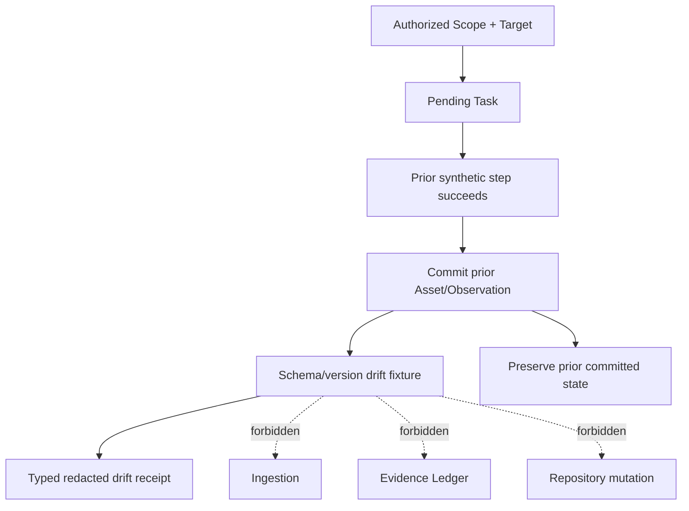

# Module 1.7 — Recon Export Presentation and Schema Drift Fixtures

**Status:** Approved and implemented — Module 1.7 closed; Phase 1 boundary reached  
**Baseline:** Module 0 closed; Module 1.0 closed; Module 1.1 closed at checkpoint `3ba4bf40`; Module 1.2 closed at checkpoint `e344411c`; Module 1.3 closed at checkpoint `b8b0eae6`; Module 1.4 closed at checkpoint `fd07a836`; Module 1.5 closed at checkpoint `70486778`; Module 1.6 closed at checkpoint `4ec28b27`  
**Migration:** None proposed or permitted in this slice  
**Security posture:** Read-only, in-memory, scope-rooted, redacted, bounded, fail-closed, deterministic offline fixtures only

> This document defines the architecture for renderer-neutral presentation adapters over Module 1.6 export models and deterministic schema/version drift fixtures. It is design-only. It does not authorize implementation, database migrations, filesystem exporters, HTML/DOM renderers, live HTTP, sockets, DNS, external subprocesses, external APIs, browser automation, or unredacted payload storage.

## 1. Executive decision

Module 1.6 established two stable contracts: an in-memory canonical export boundary and a negative Web API fixture vocabulary. The next capability should make the safe export usable by future presentation surfaces while proving that contract drift fails closed before it can become misleading Evidence, a misleading report, or a repository mutation.

Module 1.7 therefore has two deliberately separated concerns:

1. **Read-only presentation interfaces** that adapt `ReconReportJsonExport` and `StructuredSummaryPresentation` into immutable view DTOs suitable for a future CLI, Web UI, document renderer, or accessibility layer, without implementing any renderer or writing any file.
2. **Schema and version drift offline fixtures** that model deprecated field removal, unexpected contract shifts, synthetic API-version mismatches, and structural envelope changes entirely in-process and deterministically.

The presentation layer is an adapter, not a UI. The drift layer is a compatibility proof, not a live API client. Neither layer may infer live facts from synthetic data or silently accept an incompatible contract.

## 2. Scope and non-goals

### 2.1 In scope

This design defines immutable presentation DTOs, closed view sections, scalar display values, accessibility-safe labels, source/export fingerprint propagation, context validation, and a renderer-neutral adapter boundary over Module 1.6 models.

It also defines a closed schema/version drift fixture vocabulary, deterministic fixture contracts, compatibility policies, typed redacted receipts, state-preservation rules, and a test matrix for deprecated field removal, unexpected contract shifts, synthetic API-version mismatches, and structural envelope changes.

### 2.2 Explicitly out of scope

No HTML, DOM, CSS, terminal formatting, Markdown rendering, PDF generation, spreadsheet generation, image generation, chart renderer, filesystem write, temporary file, path input, upload, Web route, CLI command, live HTTP request, socket, DNS lookup, external subprocess, cloud call, AI/LLM call, retry daemon, compatibility auto-upgrade, schema migration, vulnerability finding, severity score, exploit action, or raw request/response storage is authorized by this module.

The word **presentation** means an in-memory immutable view model. It does not mean a visual renderer. The word **schema** means the synthetic fixture contract or the already-approved export schema; it does not authorize a database schema change.

## 3. Existing contracts and ownership

| Existing contract | Module 1.7 role | Forbidden change |
|---|---|---|
| `ReconReportJsonExport` | Source for safe export presentation views | No raw payload or private field access |
| `StructuredSummaryPresentation` | Source for renderer-neutral sections and metrics | No renderer methods or mutable view state |
| `ReconReportSnapshot` | Integrity/context source for presentation adapters | No recomputation from repositories |
| `ReconReportingExportService` | Creates the approved export models | No SQL, SQLite, or Evidence access in presentation |
| `ReconReportingService` | Indirect source through Module 1.6 | Presentation must not query it directly |
| `MultiWebApiNegativeScenario` | Base offline workflow context | No replacement transport or live API path |
| `OfflineNegativeReceipt` | Receipt vocabulary to extend for drift | No Evidence or repository persistence for failed drift steps |
| `PluginHost` and `ReconPipelineOrchestrator` | Execute deterministic drift fixtures | No capability widening, retry, or subprocess route |
| `ExecutionAuthorization` | Sole execution authorization model | Presentation and drift validation never create or renew authorization |
| `Task` | Sole workflow identity | No synthetic Task replacement |
| `CyberOSError` | Outer redacted typed-error boundary | No raw payload, SQL, traceback, or rejected field value leakage |

Module 1.7 consumes only the public in-memory models produced by Module 1.6. It must not reach through export internals, repositories, SQLite rows, SQL statements, Evidence mappers, or fixture implementation details.

## 4. Read-only presentation architecture

### 4.1 Boundary shape

The proposed application boundary is `ReconExportPresentationService`. It accepts one validated Module 1.6 export model and returns one immutable presentation view. It has no database, filesystem, renderer, network, or subprocess dependency.

```text
ReconReportJsonExport ───────────┐
                                 ├──> ReconExportPresentationService
StructuredSummaryPresentation ──┘              │
                                               ▼
                           ReconPresentationView
                              ├── HeaderView
                              ├── SummarySectionView[]
                              ├── MetricView[]
                              └── IntegrityView

Forbidden from every presentation path:
filesystem · HTML/DOM · renderer · upload · network · SQL · mutation · raw payload
```

The adapter must preserve the source context, generated timestamp, redaction state, completeness state, and source/export fingerprints. It may normalize labels for display, but it must not alter counts, IDs, enum semantics, or integrity digests.

### 4.2 Context-rooted request

Every presentation request must carry the Scope context from Module 1.6. The adapter must reject a request whose `scope_id`, optional `target_id`, or optional `task_id` differs from the source export. There is no presentation of a global export and no context inference from arbitrary payload fields.

```text
ReconPresentationRequest(
  scope_id: ScopeId,
  target_id: TargetId | None,
  task_id: TaskId | None,
  view_kind: PresentationViewKind,
  max_sections: int = 3,
  max_metrics_per_section: int = 32,
)
```

The initial `PresentationViewKind` allowlist is `SUMMARY` and `AUDIT_SUMMARY`. A caller cannot provide a template, HTML fragment, CSS class, filename, path, renderer name, MIME type, or destination.

### 4.3 `ReconPresentationView`

The top-level view is immutable and renderer-neutral:

```text
ReconPresentationView(
  schema_version: str = "1.0",
  view_kind: PresentationViewKind,
  context: ExportContext,
  generated_at: datetime,
  title: str,
  sections: tuple[PresentationSectionView, ...],
  source_fingerprint: str,
  export_digest: str,
  completeness: "complete",
  redaction_applied: bool,
)
```

`source_fingerprint` and `export_digest` are copied, not regenerated. A mismatch between the source DTO and the request is a typed context/integrity error. `completeness` has only the value `complete`; a budget or compatibility failure returns no view.

### 4.4 Section and metric view DTOs

```text
PresentationSectionView(
  section_id: PresentationSectionId,
  label: str,
  description: str,
  metrics: tuple[PresentationMetricView, ...],
)

PresentationMetricView(
  metric_id: str,
  label: str,
  value: str | int | bool,
  classification: PresentationMetricClassification,
  sensitive: false,
)
```

The closed section IDs are `target_recon`, `asset_distribution`, and `provenance_audit`. The adapter may provide fixed, reviewed labels and descriptions in the presentation layer. It may not copy arbitrary metadata labels, raw descriptions, request headers, body content, credentials, file paths, SQL, or rejected fixture values.

The closed metric classifications are `count`, `identity`, `status`, `digest`, and `boolean`. The `sensitive` field is always `false` in Module 1.7 because sensitive metrics are not admitted into the source models. A future sensitive-view mode requires a separate security review.

### 4.5 Accessibility and consumer neutrality

The view may carry plain-text labels and descriptions intended for future accessibility adapters. It must not carry HTML, DOM nodes, markup, CSS, JavaScript, terminal escape sequences, or presentation-specific layout instructions. A future renderer is responsible for escaping and layout; Module 1.7 is responsible for supplying safe scalar content.

## 5. Presentation budget and integrity rules

The presentation adapter must enforce bounded sections and metrics before constructing the view:

| Bound | Default | Failure |
|---|---:|---|
| Sections | 3 | `PRESENTATION_BUDGET_EXCEEDED` |
| Metrics per section | 32 | `PRESENTATION_BUDGET_EXCEEDED` |
| Label/description bytes | 16,384 total | `PRESENTATION_BUDGET_EXCEEDED` |
| View scalar bytes | 65,536 total | `PRESENTATION_BUDGET_EXCEEDED` |
| Context | One Scope, compatible refinements | `PRESENTATION_CONTEXT_INVALID` |

The adapter must fail closed rather than drop sections, truncate labels, approximate counts, or mark a partial view complete. It must preserve the Module 1.6 `export_digest` and `source_fingerprint` exactly. No new digest or signature is introduced.

## 6. Schema and version drift fixture architecture

### 6.1 Purpose and invariant

Drift fixtures prove that an offline consumer rejects incompatible synthetic contracts before they can be interpreted as successful Recon data, exported reports, Evidence, or repository state. Each fixture is deterministic, in-process, explicitly synthetic/offline, and produces an ephemeral typed receipt.

```text
Authorized Scope + Target + Task
              │
              ▼
 MultiWebApiSchemaDriftScenario
              │
              ▼
 Drift fixture presents incompatible synthetic contract
              │
              ├── typed redacted DriftReceipt
              ├── no ingestion for drift step
              ├── no Evidence/repository mutation
              └── prior committed steps preserved
```

A drift receipt is not Evidence. It is a bounded compatibility-test result and must never pollute the Evidence Ledger or Recon repository tables.

### 6.2 Closed drift vocabulary

```text
SchemaDriftCaseKind:
  DEPRECATED_FIELD_REMOVED
  UNEXPECTED_CONTRACT_SHIFT
  SYNTHETIC_API_VERSION_MISMATCH
  STRUCTURAL_ENVELOPE_CHANGED
```

Each scenario carries a closed expected contract and a synthetic presented contract:

```text
MultiWebApiSchemaDriftScenario(
  scenario_id: str,
  fixture_version: str,
  context: OfflineScenarioContext,
  case_kind: SchemaDriftCaseKind,
  expected_schema_version: str,
  presented_schema_version: str,
  expected_contract_version: str,
  presented_contract_version: str,
  expected_envelope: EnvelopeKind,
  presented_envelope: EnvelopeKind,
  drift_marker: str,
  now: datetime,
)
```

The scenario contains version strings, closed enum values, and bounded markers only. It does not contain URLs, headers, tokens, credentials, raw payloads, SQL, paths, or arbitrary JSON blobs.

### 6.3 Drift receipt

```text
SchemaDriftReceipt(
  scenario_id: str,
  fixture_version: str,
  step_id: str,
  case_kind: SchemaDriftCaseKind,
  synthetic: true,
  offline_fixture: true,
  expected_schema_version: str,
  presented_schema_version: str,
  expected_contract_version: str,
  presented_contract_version: str,
  expected_envelope: EnvelopeKind,
  presented_envelope: EnvelopeKind,
  outcome_code: str,
  committed_assets_before: int,
  committed_observations_before: int,
  committed_assets_after: int,
  committed_observations_after: int,
)
```

The receipt exposes only bounded version/envelope identifiers and before/after counters. It does not echo a removed field name if the field name could contain sensitive input, does not include raw contract payloads, and does not disclose unrelated records. It is ephemeral and in-memory.

### 6.4 Deprecated field removal

The fixture represents a previously accepted synthetic contract whose required field is absent from the presented shape. The expected result is `SCHEMA_DRIFT_DEPRECATED_FIELD_REMOVED`, with no best-effort defaulting unless that default is explicitly part of the approved contract. The fixture must not silently reconstruct the field from arbitrary metadata or a raw body.

The failure occurs before ingestion. Earlier committed endpoint/header/parameter observations remain unchanged, while the drift step produces no Asset, Observation, Evidence, or repository row.

### 6.5 Unexpected contract shift

The fixture presents a known contract version with a changed field type, changed required/optional semantics, or an unsupported enum value. These shapes are represented by closed `ContractShiftKind` values rather than arbitrary payloads. The consumer returns `SCHEMA_DRIFT_CONTRACT_SHIFT` and does not coerce, clamp, or silently discard the changed field.

### 6.6 Synthetic API-version mismatch

The fixture presents a bounded API version such as `v2` to a consumer expecting `v1`, or presents a plugin contract version outside the supported range. The consumer returns `SCHEMA_DRIFT_VERSION_MISMATCH`. It must not negotiate a version, downgrade, upgrade, retry, or modify PluginManifest/contract policy automatically.

The mismatch is synthetic metadata only. It is not evidence that a real API or plugin advertised that version.

### 6.7 Structural envelope change

The fixture compares a closed envelope enum such as `data`, `result`, `items`, or `error` with an expected envelope. A changed envelope returns `SCHEMA_DRIFT_ENVELOPE_CHANGED` before any field extraction or ingestion. No raw envelope body is retained or echoed.

### 6.8 Drift workflow composition

The recommended flow extends the Module 1.6 negative workflow:



The selected drift case is declared in the scenario and cannot be inferred from arbitrary data. The scenario and receipt are labelled `synthetic=true` and `offline_fixture=true`. No automatic retry, compatibility negotiation, authorization renewal, sleep, or subprocess is permitted.

## 7. Security, privacy, and error semantics

| Boundary | Required enforcement |
|---|---|
| Scope root | Every presentation request and drift scenario carries a valid `scope_id` |
| Context | Target/Task refinements match the existing Scope hierarchy |
| Authorization | Existing `ExecutionAuthorization` remains the only workflow authorization |
| Presentation | In-memory immutable view only; no HTML/DOM/filesystem/rendering side effect |
| Export integrity | Fingerprints and digests are copied exactly and mismatches fail closed |
| Drift | Incompatible synthetic contracts produce typed receipts before ingestion |
| Persistence | No drift Evidence, Asset, Observation, or repository row is created |
| Privacy | No raw payload, removed field value, token, credential, path, SQL, or traceback escapes |
| Retry | No retry, negotiation, downgrade, upgrade, backoff, sleep, or auth renewal |
| Limits | Presentation sections/metrics/bytes and drift metadata/steps are bounded |
| Labels | Every drift receipt remains visibly synthetic and offline |
| Transport | No HTTP client, socket, DNS, subprocess, external API, or live scanner |

Proposed typed error codes are:

| Error code | Meaning | Redaction policy |
|---|---|---|
| `PRESENTATION_CONTEXT_INVALID` | Presentation request does not match source export context | Safe context category only |
| `PRESENTATION_BUDGET_EXCEEDED` | View sections, metrics, or scalar bytes exceed bounds | Expose bound/category only |
| `PRESENTATION_MODEL_INVALID` | Source view contains an unsupported section, metric, or value | Generic model failure |
| `PRESENTATION_INTEGRITY_INVALID` | Fingerprint, digest, completeness, or context invariant fails | No raw source details |
| `SCHEMA_DRIFT_FIXTURE_INVALID` | Drift scenario uses an unsupported closed value or bound | Field/category only |
| `SCHEMA_DRIFT_DEPRECATED_FIELD_REMOVED` | Required synthetic field is absent | Do not echo raw shape/value |
| `SCHEMA_DRIFT_CONTRACT_SHIFT` | Synthetic contract semantics changed unexpectedly | Closed shift category only |
| `SCHEMA_DRIFT_VERSION_MISMATCH` | Presented synthetic API/plugin version is unsupported | Version identifiers only |
| `SCHEMA_DRIFT_ENVELOPE_CHANGED` | Synthetic response envelope differs from expected | Envelope enums only |
| `SCHEMA_DRIFT_EXPECTATION_FAILED` | Observed in-process state differs from expected preservation rules | Counts and closed code only |

Existing `CyberOSError` remains the outer boundary. JSON internals, SQLite errors, filesystem errors, raw fixture values, SQL, and tracebacks must never escape.

## 8. Transaction and performance boundaries

Presentation adaptation reads only the already-built Module 1.6 export model. It does not open a database or transaction and does not persist a view, cache, template, or renderer state.

Drift scenarios preserve Module 1.2 and Module 1.6 boundaries: successful prior steps may be committed through existing ingestion, while the drift step is rejected before ingestion. The harness must not wrap setup, execution, ingestion, Evidence, export, and presentation into one long transaction.

All counters are bounded: section count, metric count, label bytes, drift steps, version string lengths, receipt bytes, and before/after committed counts. No queue, worker, retry scheduler, compatibility registry, or schema migration is introduced.

## 9. Test and verification strategy

The future implementation must add tests without modifying Modules 0–1.6:

| Test family | Required proof |
|---|---|
| Presentation context | Scope-rooted request, compatible Target/Task, cross-context rejection |
| Presentation projection | Closed sections, scalar metrics, immutable tuples/mappings, no renderer fields |
| Presentation integrity | Exact source/export fingerprint propagation and completeness preservation |
| Presentation budgets | Section, metric, label, and scalar-byte overflow fails closed without truncation |
| Presentation privacy | No HTML/DOM, raw metadata, body, header, credential, path, SQL, or traceback leakage |
| Deprecated field drift | Missing required synthetic field returns typed receipt before ingestion |
| Contract shift drift | Changed type/semantics/enum returns typed receipt without coercion |
| Version mismatch | Unsupported synthetic API/plugin version fails with no negotiation or retry |
| Envelope drift | Changed synthetic envelope fails before field extraction or persistence |
| Drift labels | Receipt has synthetic/offline markers and bounded version/envelope identifiers |
| State preservation | Prior committed step remains; drift step creates no Asset/Observation/Evidence/repository row |
| Context isolation | Cross-Scope/Target/Task drift requests fail closed and redacted |
| No retry | No sleep, retry, backoff, downgrade, upgrade, or authorization renewal |
| No side effects | No filesystem, network, socket, DNS, subprocess, external API, live scanner, or AI/LLM |
| Regression | All existing 350 tests remain green |

The boundary scan must inspect only new Module 1.7 implementation/test files after approval and use precise forbidden-API patterns. It must not treat documentation words such as `HTML`, `HTTP`, `schema`, or synthetic version strings as live side effects.

## 10. Decisions requiring explicit approval

| Decision | Proposed choice | Why it matters |
|---|---|---|
| Presentation boundary | In-memory `ReconExportPresentationService` over Module 1.6 export models | Prevents renderer, SQL, and filesystem leakage |
| Presentation models | Immutable `ReconPresentationView`, sections, and scalar metrics | Supports future CLI/Web/accessibility adapters without implementing them now |
| Context | Mandatory Scope-rooted request with compatible Target/Task refinements | Preserves engagement isolation |
| Presentation format | Renderer-neutral only; no HTML/DOM/Markdown/PDF output | Keeps publication and UI concerns deferred |
| Presentation limits | Closed sections, metrics, label bytes, and scalar bytes | Bounds memory and prevents partial views |
| Drift vocabulary | Deprecated field removal, contract shift, version mismatch, envelope change | Covers compatibility failures without live transport |
| Drift policy | Fail closed before ingestion; no coercion or best-effort defaults | Prevents misleading synthetic Evidence |
| Drift receipts | Ephemeral typed redacted receipts only | Avoids polluting Evidence and repository tables |
| Retry/negotiation | Zero retry, sleep, backoff, upgrade, downgrade, or auth renewal | Prevents hidden side effects and policy bypass |
| Persistence | Zero migrations, zero filesystem exporters, zero new tables/state | Keeps Module 1.7 additive and local-first |

## 11. Approval gate

Implementation was authorized after explicit approval of the presentation DTO/view-adapter boundary, closed section and metric vocabulary, Scope-rooted context and integrity propagation, presentation budgets, no-renderer/no-filesystem policy, schema drift vocabulary, deprecated-field/contract-shift/version/envelope semantics, ephemeral redacted receipts, no-ingestion/no-pollution rule, no-retry/no-negotiation policy, and zero-migration/no-live-side-effect constraints. These constraints were preserved during implementation. The module is now closed at its Phase 1 boundary; no Phase 2 implementation is authorized by this record.

## 12. Implementation record

The approved implementation added immutable presentation contracts in `src/cyberos/domain/recon/presentation.py`, the read-only adapter in `src/cyberos/application/recon_export_presentation.py`, bounded schema-drift contracts in `src/cyberos/domain/recon/schema_drift.py`, and the deterministic harness in `src/cyberos/application/offline_web_api_drift.py`. It also added the integration/security matrix in `tests/integration/test_recon_presentation_and_drift.py` and the ten typed Module 1.7 error codes in `src/cyberos/core/errors.py`.

The final local quality gates passed with **360 tests**, Ruff check, Ruff format check, `mypy --strict`, and wheel build. The precise boundary scan found no socket, HTTP client, DNS, subprocess, `open`, `Path`, `mkdir`, or `write_text` usage in the new implementation files. No migration, renderer, filesystem exporter, live network call, subprocess, retry, negotiation, or authorization renewal was added.

## Internal references

1. Module 1.6 reporting export and negative fixtures design: `cyberos-core/docs/architecture/module-1-6-recon-reporting-export-and-negative-fixtures-design.md`.
2. Module 1.5 reporting and Web API offline fixtures design: `cyberos-core/docs/architecture/module-1-5-recon-reporting-and-web-api-fixtures-design.md`.
3. Module 1.4 Evidence Query and offline workflow design: `cyberos-core/docs/architecture/module-1-4-recon-evidence-query-and-offline-workflow-design.md`.
4. Module 1.3 Evidence and provenance design: `cyberos-core/docs/architecture/module-1-3-recon-evidence-provenance-design.md`.
5. Module 1.2 pipeline orchestration design: `cyberos-core/docs/architecture/module-1-2-recon-orchestration-design.md`.
