# Module 2.2 — Explicit Scope Expansion & Bounded Multi-Host Recon

**Status:** Architecture design only. No implementation, migration, live multi-host scan, socket, subprocess, or external API call is authorized by this document.

## 1. Purpose

Module 2.2 defines a safe orchestration layer for recon across a **bounded, explicitly approved set of hosts**. Its purpose is not to create a fast network scanner or to bypass existing tools. It is a personal CyberOS control plane that turns approved target records into deterministic host execution plans, enforces independent authorization and budgets per host, and aggregates already-committed Recon/Evidence receipts.

The module is designed for the progression from single-host lab work toward Network/AD/Cloud learning environments while preserving the project’s local-first, privacy-first, fail-closed principles.

> **Design invariant:** A batch does not create implicit authority. Each host still requires a canonical persisted Target, a current Scope decision, and a fresh `ExecutionAuthorization` bound to that host before any adapter may run.

## 2. Current Preconditions and Explicit Non-Goals

The present localhost adapter remains restricted to `127.0.0.1`; Module 2.2 must not weaken that policy. It may orchestrate offline fixtures immediately after approval, but a live multi-host adapter needs a future, separately approved tool-specific contract.

The second P3 attempt correctly finalized a parser failure as `FAILED`, but it did not complete evidence ingestion because standard Nmap `state` metadata is not yet accepted. That compatibility patch and a successful subsequent localhost P3 receipt are **preconditions for enabling any live Module 2.2 execution**. They do not prevent design review.

| In scope | Explicitly out of scope |
|---|---|
| Host-plan preview, target-bound batch orchestration, per-host limits, sequential scheduling, receipts, cancellation, and offline fixtures | Port scanning implementation, Nmap flag changes, CIDR-wide live scanning, DNS discovery, home-network scanning, concurrency, retry/backoff, daemons, raw artifact storage, automatic target discovery, external APIs, AI/LLM |

## 3. Architectural Conflict: Authorized Scope Immutability

The existing model intentionally prevents adding or modifying Targets inside an `AUTHORIZED` Scope. This prevents a caller from widening an approved engagement after authorization. Therefore, an execution-time CIDR enumerator that silently materializes new hosts would contradict Module 0’s scope immutability and fail-closed contract.

The recommended resolution is a staged approach.

| Option | Description | Decision |
|---|---|---|
| A. Materialize hosts into an authorized Scope | Adds Target rows after authorization | **Rejected:** breaks authorized Scope immutability |
| B. Execute directly from an ephemeral CIDR expansion | Runs candidates without persisted target identity | **Rejected:** breaks target-bound Task/Evidence provenance |
| C. Batch only pre-existing explicit Targets | Schedules only active Target rows already inside the authorized Scope | **Recommended for Module 2.2.a:** zero migration and preserves all current invariants |
| D. Scope revision workflow | A new draft successor Scope receives reviewed materialized targets and is authorized independently | **Deferred to Module 2.2.b:** requires a separate migration/domain approval |

Accordingly, **“scope expansion” in Module 2.2.a means explicit candidate preview and batching over already materialized Targets, not automatic live CIDR enumeration.** Any source CIDR may be used only as a preview input during a draft/review workflow; it cannot authorize execution by itself.

## 4. Core Invariants

| ID | Invariant |
|---|---|
| I-01 | No batch contains a raw host string as an executable target. Every scheduled item references one active persisted `TargetId`. |
| I-02 | A host is eligible only when `ScopeValidationService.authorize_execution()` returns an active, include-based, unexpired `ExecutionAuthorization` for that exact canonical Target. |
| I-03 | Exclude rules always override include rules. Unknown, stale, archived, mismatched, or duplicate targets are rejected. |
| I-04 | The batch cannot widen a tool manifest, port set, timeout, output cap, or environment policy. Effective limits are the minimum of batch, task, adapter, and authorization limits. |
| I-05 | Each host produces an independent Task and transaction boundary. A committed host remains committed if a later host fails or is cancelled. |
| I-06 | No retries, fallback tool, target substitution, background worker, parallel fan-out, DNS expansion, or authorization renewal is allowed. |
| I-07 | Raw stdout, stderr, command lines, secrets, and XML bodies never enter batch reports, persistence, or errors. |

## 5. Proposed Components and Data Flow

```mermaid
flowchart LR
    A[Explicit Target IDs\ninside authorized Scope] --> B[ScopeExpansionPreviewService]
    B --> C[BoundedBatchDefinition\nimmutable host list + budgets]
    C --> D[MultiHostReconOrchestrator\nsequential only]
    D --> E[Per-host ScopeValidationService]
    E -->|fresh bound authorization| F[HostReconRunner Port]
    F --> G[Existing adapter service\nfuture tool-specific implementation]
    G --> H[Task + ReconIngestionService]
    H --> I[Evidence persistence]
    I --> J[HostReceipt]
    J --> K[ReconBatchReport\nredacted scalar totals]
```



`ScopeExpansionPreviewService` is pure/read-only. It canonicalizes proposed values only for review, resolves them to existing Target records, applies deterministic sorting, and produces an immutable preview. It neither persists candidates nor issues authorization.

`MultiHostReconOrchestrator` accepts an approved `BoundedBatchDefinition` and a host runner port. It processes hosts serially in stable order, re-authorizes immediately before each host, and invokes the runner only with the exact Target/Authorization pair. In Module 2.2.a the runner is an offline fixture; a real network runner remains a future adapter-specific approval.

## 6. Domain and Application Contracts

All contracts are frozen/immutable and use typed IDs rather than raw strings.

```python
@dataclass(frozen=True, slots=True)
class ScopeExpansionPreviewRequest:
    scope_id: ScopeId
    target_ids: tuple[TargetId, ...]
    max_hosts: int

@dataclass(frozen=True, slots=True)
class ScopeExpansionPreview:
    scope_id: ScopeId
    eligible_target_ids: tuple[TargetId, ...]
    rejected: tuple[PreviewRejection, ...]
    source_fingerprint: str

@dataclass(frozen=True, slots=True)
class BoundedBatchDefinition:
    batch_id: UUID
    scope_id: ScopeId
    target_ids: tuple[TargetId, ...]
    max_hosts: int
    max_total_duration_seconds: int
    max_total_output_bytes: int
    tool_profile_id: str

@dataclass(frozen=True, slots=True)
class HostExecutionPlan:
    target_id: TargetId
    authorization: ExecutionAuthorization
    effective_limits: ExecutionLimits
    tool_profile_id: str

@dataclass(frozen=True, slots=True)
class HostReceipt:
    target_id: TargetId
    task_id: TaskId | None
    outcome: HostOutcome
    redacted_error_code: ErrorCode | None
    assets_committed: int
    observations_committed: int
    evidence_created: int

@dataclass(frozen=True, slots=True)
class ReconBatchReport:
    batch_id: UUID
    scope_id: ScopeId
    outcome: BatchOutcome
    planned_hosts: int
    attempted_hosts: int
    completed_hosts: int
    failed_hosts: int
    cancelled_hosts: int
    host_receipts: tuple[HostReceipt, ...]
    source_fingerprint: str
```

`HostReconRunner` is an application port, not an authorization bypass:

```python
class HostReconRunner(Protocol):
    def run(self, plan: HostExecutionPlan) -> HostReceipt: ...
```

The runner receives no Scope-wide authority, no mutable batch object, no arbitrary command, and no ability to choose another host. It must use an approved adapter service that revalidates its own target/tool controls.

## 7. Budgets, Scheduling, and State Model

The initial scheduler is deliberately sequential. Stable ordering is by canonical target value, then `TargetId`, and a maximum host budget is validated before work begins. The exact initial maximum (recommended: **16 targets**) is a decision requiring approval; the module rejects any request above the approved bound rather than truncating it.

| Layer | Limit | Enforcement |
|---|---|---|
| Preview | `max_hosts` | Reject duplicate, unknown, archived, excluded, or over-budget targets before batch creation |
| Batch | total duration/output ceilings | Reject plan before host invocation when remaining budget is insufficient |
| Host | adapter Task limits | Existing adapter performs fail-closed validation again |
| Persistence | per-host atomic ingest | Existing Recon/Evidence services commit or roll back each host independently |

```text
CREATED → PREFLIGHTED → RUNNING → COMPLETED
                         ├── PARTIALLY_COMPLETED
                         ├── FAILED
                         └── CANCELLED
```

`PARTIALLY_COMPLETED` means at least one host committed successfully and a later host failed or was cancelled. It is a batch-report outcome, not a change to the closed `TaskStatus` model. Individual Tasks retain their established lifecycle.

## 8. Failure and Cancellation Policy

| Condition | Host behavior | Batch behavior | Persistence |
|---|---|---|---|
| Preflight target/authorization mismatch | Do not invoke runner | Host receipt rejected; continue only if policy permits | None |
| Budget exhausted before next host | Do not invoke runner | `PARTIALLY_COMPLETED` or `FAILED` | Earlier commits remain |
| Adapter/parser/ingestion typed failure | Host Task follows its own terminal failure policy | Continue to next host only if fail-isolation policy is approved | Failed host has no partial raw output; earlier commits remain |
| Cancellation before host invocation | Do not invoke runner | `CANCELLED` / `PARTIALLY_COMPLETED` | Earlier commits remain |
| Cancellation after adapter returns but before ingest | Reject uncommitted output | `CANCELLED` / `PARTIALLY_COMPLETED` | No new Evidence for cancelled result |
| Unexpected exception | Convert at boundary to redacted typed error | Stop batch fail-closed | No traceback/raw data |

The default recommendation is **stop on security/preflight failure, isolate tool/parser failure per host, and stop on cancellation or total-budget exhaustion**. This distinction requires approval because it affects operational semantics.

## 9. Persistence and Schema Strategy

Module 2.2.a introduces **no migration**. It reuses existing `scopes`, `targets`, `tasks`, `assets`, `asset_observations`, and `evidence_records` tables. The batch itself is ephemeral for the first slice: the returned `ReconBatchReport` may be exported through existing in-memory reporting contracts but is not written to disk or a new table.

The deferred Scope revision workflow (Option D) requires a separate design and likely a future migration. It must preserve the original authorized Scope as immutable and make provenance from a materialized Target back to a reviewed source explicit. No migration number or DDL is approved in this design.

## 10. API, CLI, and UI Boundaries

No interface is implemented by this document. The proposed future contracts are:

| Surface | Proposed operation | Safety rule |
|---|---|---|
| Application API | `preview(scope_id, target_ids, max_hosts)` | Read-only; requires scope root; no authority issued |
| Application API | `run(batch_definition, cancellation_signal)` | Requires explicit batch and per-host authorization; fixture-only initially |
| CLI | `cyberos recon batch-preview SCOPE_ID --target-id ...` | Emits redacted deterministic preview; no execution |
| CLI | `cyberos recon batch-run BATCH_INPUT` | Deferred until an explicit execution policy is approved |
| React UI | Batch preview review panel | Must display target IDs, rejects, limits, and authorization expiry, not raw tool outputs |

## 11. Test Strategy

The initial test matrix must be fully offline and use injected `HostReconRunner` doubles.

| Test group | Required proof |
|---|---|
| Preview validation | Mandatory scope, non-empty targets, duplicate rejection, deterministic order, max-host rejection |
| Scope isolation | Cross-scope TargetId, archived Target, exclude precedence, expired scope, and target drift all fail before runner invocation |
| Authorization | Fresh per-host authorization; no reuse from one Target to another; no renewal |
| Scheduler | Sequential order, no concurrency, no retry/backoff, total budget enforcement |
| Atomicity | Each host commits independently; parser/provenance failure leaves no partial Evidence for that host |
| Cancellation | Cancel-before-run and cancel-before-ingest preserve prior committed host receipts only |
| Privacy | Reports contain scalar counts/digests/redacted error codes only; no XML, paths, command lines, secrets, SQL, or tracebacks |
| Boundary scan | No socket/DNS/HTTP/subprocess/new migration/file exporter in Module 2.2.a |

## 12. Security Considerations

The module must remain deny-by-default, local-first, and audit-friendly. It is not a permit to scan a subnet merely because a CIDR is syntactically valid. All source candidate sets are treated as untrusted input, explicit excludes win, no target is inferred from service output, and no host discovery result becomes executable without passing the normal Target/Scope/Authorization path.

The first implementation must not add concurrency because parallelism makes resource caps, cancellation, and evidence ordering less auditable. Any future concurrent scheduler needs an independent threat review, deterministic receipt ordering, a global semaphore, and strict queue cancellation semantics.

## 13. Proposed Implementation Slices After Approval

| Slice | Deliverable | Live execution |
|---|---|---:|
| 2.2.a | Preview DTOs, `ScopeExpansionPreviewService`, explicit Target-only batch definition, offline host-runner double | No |
| 2.2.b | Sequential `MultiHostReconOrchestrator`, budgets, cancellation, batch report, offline atomicity tests | No |
| 2.2.c | CLI batch preview and read-only report projection | No |
| 2.2.d | Scope revision/materialization design and separate schema decision | No |
| 2.2.e | Tool-specific, separately authorized live multi-host adapter integration | Only after distinct approval |

## 14. Decisions Requiring Explicit Approval

Before any implementation, the following decisions must be approved:

1. Adopt Option C for Module 2.2.a: explicit pre-existing Target IDs only, no automatic CIDR materialization.
2. Set the initial batch host maximum (recommended 16) and total duration/output budgets.
3. Adopt sequential-only execution and the proposed stop/isolate failure policy.
4. Keep batch reports ephemeral with zero migrations in 2.2.a–c.
5. Defer Scope revision/materialization and any live multi-host adapter to later approval.
6. Keep the current localhost Nmap policy unchanged; Module 2.2 must not widen it.

## 15. Approval Gate and Stop Condition

This document authorizes no code and no live scan. The next implementation may begin only after explicit approval of Section 14. Separately, no future P3 retry should occur until the standard Nmap `state` metadata parser compatibility issue is fixed offline, quality-gated, and explicitly authorized for a new single invocation.
