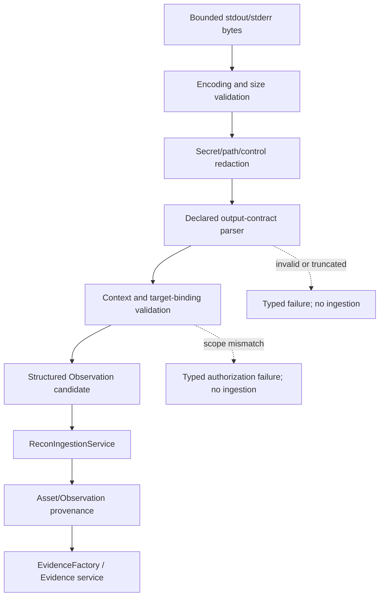

# Phase 2 Overview & Module 2.0 — Live Adapter Boundary Design

**Status:** Approved and implemented — Module 2.0 contract slice closed; tool-specific adapters not authorized  
**Phase 1 baseline:** Offline Foundation officially closed at checkpoint `62519a4e` with 360 passing tests and green GitHub Actions  
**Target file:** `cyberos-core/docs/architecture/phase-2-overview-and-module-2-0-live-adapter-boundary-design.md`  
**Migration policy:** No migration proposed or authorized in this design slice  
**Execution policy:** No live subprocess, network, DNS, HTTP, external scanner, or cloud call may run during design review

> This document is an architecture boundary, not an implementation specification that may be executed automatically. It defines how CyberOS could move from deterministic offline fixtures to carefully authorized live adapters while preserving the existing Scope, Target, Task, ExecutionAuthorization, PluginHost, Pipeline, Observation, Evidence, reporting, and privacy contracts.

## 1. Phase 1 closure and transition decision

Phase 1, the **Offline Foundation**, is officially closed. It established the domain hierarchy, target and scope policy, target-bound and time-aware authorization, safe Task execution contracts, the deny-by-default plugin boundary, recon asset persistence, pipeline orchestration, provenance Evidence, bounded read APIs, reporting, canonical in-memory exports, presentation adapters, and deterministic negative/schema-drift fixtures.

The verified baseline is 360 passing tests, successful Ruff and formatting checks, `mypy --strict`, wheel build, security boundary scans, commit `62519a4`, and successful CI run `31809760671`. This baseline is protected. Phase 2 must not reopen or refactor Phase 1 modules except for a concrete regression or a documented architectural contradiction approved by the user.

The transition to Phase 2 is not a transition to unrestricted scanning. It is a transition from **in-process synthetic producers** to **explicitly mediated live adapters**. Every live action remains a Task-bound, target-bound, scope-bound, authorization-bound operation with bounded resources, redacted outputs, and auditable terminal state.

## 2. Phase 2 high-level vision

### 2.1 Purpose

Phase 2 introduces carefully isolated adapters for approved external security engines and operating-system tools. Its purpose is to make CyberOS a personal engineering layer over proven tools rather than another collection of scanners. A live adapter will provide safe invocation and normalization; it will not replace mature engines, infer authorization, widen scope, or become an unreviewed general-purpose command runner.

The initial Phase 2 progression is deliberately staged:

| Stage | Capability family | Architectural purpose | Default execution posture |
|---:|---|---|---|
| 2.0 | Live subprocess and execution adapter boundary | Establish the only approved path from CyberOS to a local process | Design first; no tool integration in this slice |
| 2.1 | Network/recon adapter contracts | Add adapter manifests and normalized result contracts for approved engines | Offline contract fixtures before live commands |
| 2.2 | HTTP probing adapter boundary | Mediate bounded HTTP probing through an approved adapter | Explicit target and rate/timeout policy |
| 2.3 | OSINT/discovery adapter boundary | Normalize discovery outputs without widening target scope | Authorized, bounded, redacted results |
| 2.4 | Live evidence ingestion hardening | Bind accepted observations to Task, Asset, and Evidence provenance | No raw artifact persistence by default |

These stage labels are directional only. They do not authorize implementation of Nmap, DNS, HTTP, Subfinder, httpx, Burp, Nuclei, cloud scanners, or external APIs. Each future adapter requires its own design review and explicit approval.

### 2.2 Non-negotiable safety principles

The following principles are invariant across every Phase 2 module:

1. **Scope is a security boundary.** A live adapter may act only on the exact target selected by the current Scope policy. Include/exclude semantics remain fail-closed, and Exclude takes precedence over Include.
2. **Authorization is a prerequisite.** The operation must carry the existing `ExecutionAuthorization`, bound to the same `scope_id`, `target_id`, matching rule, and unexpired authorization state. No adapter may create, renew, infer, or broaden authorization.
3. **Task remains the execution model.** The adapter does not create a second job, scan, token, or authorization model. It runs only under an existing Task lifecycle and its existing limits.
4. **argv is structural.** Commands are passed as a validated immutable argv sequence to an execution primitive with `shell=False`. Raw shell strings, shell interpolation, shell metacharacter parsing, implicit executable lookup, and unreviewed flags are rejected.
5. **Limits are fail-closed.** Timeout, output, environment, argument, observation, asset, and concurrency limits are enforced before and during execution. Results exceeding a limit are rejected or terminated according to the approved policy; they are not silently clamped into a successful result.
6. **Output is untrusted input.** stdout and stderr are bounded byte streams. They are decoded with an explicit policy, redacted, parsed against an allowlisted result contract, and converted to structured Observations/Evidence only after context validation.
7. **Privacy is the default.** Credentials, tokens, cookies, authorization headers, local paths, SQL, command internals, raw response bodies, and unbounded tool output must not escape the redaction boundary or be written to arbitrary disk.
8. **No hidden side effects.** The adapter has no retry, auto-update, package installation, network fallback, authentication renewal, shell spawn, background daemon, or undeclared child process behavior.

## 3. Module 2.0 boundary

### 3.1 Proposed names and responsibilities

`LiveSubprocessAdapter` is the application-facing boundary for a **single authorized local process invocation**. `CommandSandbox` is the internal policy object that validates the command plan, environment, working directory, limits, and target context before the process is spawned.

```text
Task + ExecutionAuthorization + TargetContext
                  │
                  ▼
        LiveSubprocessRequest
                  │
                  ▼
          CommandSandbox
     validation · allowlists · limits
                  │
                  ▼
       LiveSubprocessAdapter
     shell=False · bounded streams
                  │
                  ▼
      BoundedProcessReceipt
                  │
                  ▼
  parser/redactor/normalizer boundary
                  │
        ┌─────────┴─────────┐
        ▼                   ▼
  ReconObservation     EvidenceFactory
  (Module 1.1/1.2)    (Module 1.3)
```

The adapter owns process mediation and bounded execution. It does not own Scope evaluation, Task persistence, Evidence persistence, reporting, presentation, or tool-specific business semantics. The application orchestrator remains responsible for Task transitions and short UnitOfWork boundaries, as established by Module 0 and Module 1.2.

### 3.2 In scope for Module 2.0 design

This design covers the request/receipt contracts, authorization preconditions, command plan validation, executable and flag allowlists, environment isolation, working-directory policy, timeout and termination behavior, stdout/stderr memory caps, redaction/normalization boundaries, typed errors, audit-safe metadata, and test strategy.

### 3.3 Explicitly out of scope

The following are not authorized by this document:

| Excluded capability | Reason |
|---|---|
| Nmap, Masscan, Subfinder, httpx, Nuclei, Burp, cloud scanners | Tool-specific design and risk review are separate modules |
| DNS/HTTP sockets or external APIs | Module 2.0 is a process boundary, not a transport client |
| Shell execution, shell scripts, command strings, `shell=True` | Structurally incompatible with the security boundary |
| Process-tree isolation or OS containerization | Requires a separate platform/security design |
| Arbitrary executable discovery through `PATH` | Executables must be explicit and allowlisted |
| Filesystem artifact exporter or raw-output archive | Raw retention requires a separate privacy and storage review |
| New database migration | Existing schema and provenance contracts remain unchanged |
| New CLI command or Web UI | Interfaces follow after the adapter contract is proven |
| Automatic retries, backoff, auth renewal, package installation, or updates | Hidden side effects and policy bypass |
| AI/LLM analysis of tool output | Deferred until live evidence and privacy boundaries are stable |

## 4. Live subprocess contracts

### 4.1 `LiveSubprocessRequest`

The request is host-created, immutable, and fully bound before any spawn operation. A plugin or parser must not be able to construct an authorization or modify the request after validation.

```text
LiveSubprocessRequest(
  task: Task,
  authorization: ExecutionAuthorization,
  scope_id: ScopeId,
  target_id: TargetId,
  target_kind: TargetKind,
  canonical_target: str,
  command: tuple[str, ...],
  allowed_executable_id: str,
  allowed_flags: tuple[str, ...],
  environment: tuple[tuple[str, str], ...],
  working_directory: ApprovedWorkingDirectory | None,
  timeout_seconds: int,
  max_stdout_bytes: int,
  max_stderr_bytes: int,
  max_argument_bytes: int,
  output_contract_version: str,
)
```

`scope_id` and `target_id` are copied from the Task and must agree with the authorization. `canonical_target` is not accepted from an arbitrary plugin payload; it must be resolved from the already-authorized Target context. The request contains no raw shell string, no executable path supplied by a plugin, no arbitrary environment map, and no output destination.

### 4.2 `CommandSandbox`

`CommandSandbox` is a pure validation/policy boundary before spawn. It returns an immutable validated plan or a typed error. It must not mutate the Task, authorization, Scope, Target, or repository.

```text
ValidatedCommandPlan(
  executable: ApprovedExecutableId,
  argv: tuple[str, ...],
  sanitized_environment: tuple[tuple[str, str], ...],
  approved_working_directory: ApprovedWorkingDirectory | None,
  timeout_seconds: int,
  stdout_limit: int,
  stderr_limit: int,
  target_binding_digest: str,
)
```

The binding digest is an audit-safe digest of the authorized context and command policy. It is not a secret, a capability token, or a substitute for authorization checks. It must never be used to grant access to another target.

### 4.3 `BoundedProcessReceipt`

The process adapter returns a receipt that is safe for application-level interpretation:

```text
BoundedProcessReceipt(
  executable_id: str,
  exit_code: int | None,
  stdout: bytes,
  stderr: bytes,
  stdout_truncated: bool,
  stderr_truncated: bool,
  timeout_exceeded: bool,
  termination: TerminationKind,
  duration_ms: int,
  output_digest: str,
  redaction_applied: bool,
)
```

Raw bytes are bounded and ephemeral at this boundary. The receipt does not contain a command string, working-directory path, environment values, authorization reference, credentials, or arbitrary child-process metadata. A future parser receives only the bounded stream and the declared output contract; it must not receive the full process environment or a live authorization object unless a separate contract requires it.

## 5. Authorization and target context verification

### 5.1 Verification sequence

No process may be spawned until all checks pass in this order:

```text
1. Request is structurally valid and immutable
2. Task status is PENDING and Task identity is stable
3. request.scope_id == task.scope_id == authorization.scope_id
4. request.target_id == task.target_id == authorization.matched_target_id
5. authorization decision is positive and matching rule is INCLUDE
6. authorization has not expired at the same UTC clock instant
7. Target exists, is active, belongs to the requested Scope, and is not excluded
8. canonical target equals the persisted/authorized target representation
9. command contract declares support for the target kind
10. requested limits do not exceed Task, Plugin, or adapter policy
11. only then may CommandSandbox produce a validated plan
12. only then may LiveSubprocessAdapter spawn with shell=False
```

Any failure terminates the request before spawn and returns `LIVE_ADAPTER_UNAUTHORIZED`, `COMMAND_SANITIZATION_FAILED`, or another approved typed error. The adapter must not retry the failed validation or attempt a different target representation.

### 5.2 Context non-bypassability

The adapter must reject all of the following even if a process or plugin requests them:

| Attempt | Required result |
|---|---|
| Different target ID with same Scope | Reject authorization mismatch |
| Excluded target | Reject fail-closed before spawn |
| Expired authorization | Reject `LIVE_ADAPTER_UNAUTHORIZED` |
| Draft/archived/non-authorized Scope | Reject before command validation completes |
| URL containing credentials, fragment, or unapproved query | Reject Target/command contract |
| Wildcard passed to a concrete-only adapter | Reject unsupported target kind |
| Hostname or IP inferred from arbitrary stdout | Do not treat as authorization |
| Target supplied in an untrusted flag instead of the bound context | Reject contract or ignore only when explicitly specified by adapter policy |
| Plugin-supplied environment with authorization-like variables | Reject or strip; never use as authorization |

## 6. Command sanitization and execution policy

### 6.1 Executable allowlist

An adapter manifest must identify the executable by a stable logical ID, version/contract range, and approved absolute executable identity. The caller selects the logical ID, not an arbitrary path. The host resolves that ID through a reviewed registry. `PATH` lookup is not sufficient as an identity boundary.

The allowlist must state supported target kinds, permitted flags, positional argument grammar, output contract, expected exit-code vocabulary, resource limits, and whether the tool may create child processes. A tool with undeclared child-process behavior is not eligible for the initial boundary.

### 6.2 argv-only rules

The only accepted command representation is `tuple[str, ...]` with the executable and each argument as a separate element. The following are rejected:

```text
"tool --target example.com"
"tool; rm -rf ..."
"tool && other-command"
"tool | parser"
"$(command)"
"`command`"
shell=True
shell expansion, globbing, redirection, command substitution, and implicit pipes
```

Presence of shell metacharacters is not made safe by quoting. For a strict adapter, the safer policy is to reject metacharacters in fields whose grammar does not require them, and to permit only a reviewed character grammar for each target/flag parameter.

### 6.3 Argument grammar

Each positional and flag argument must pass an adapter-specific grammar:

| Argument class | Example policy |
|---|---|
| Target value | Must equal the authorized canonical target; no alternate target list |
| Numeric limit | ASCII decimal, bounded range, no signs or expressions unless explicitly needed |
| Enum flag | Closed enum mapping only |
| Output mode | Fixed machine-readable mode selected by manifest |
| File/path argument | Disallowed in Module 2.0 unless a future approved sandbox path contract exists |
| Free-form string | Disallowed by default; requires explicit field-level review |

The adapter must not silently remove an argument, rewrite a target, clamp a limit, or choose a safer-looking fallback. It returns `COMMAND_SANITIZATION_FAILED` and records only the rejected argument category, not the raw value.

### 6.4 Environment isolation

The child process must not inherit the parent environment implicitly. The default environment is empty. Each adapter may declare a small allowlist of non-secret, deterministic variables such as locale or tool mode. Sensitive variables, proxy variables, credential variables, dynamic loader variables, shell initialization variables, and path mutation variables are denied by default.

The environment contract must reject duplicate keys, control characters, oversized names/values, and unapproved keys. It must not accept a plugin-provided `PATH` to redirect executable resolution. The environment is represented as a sorted immutable tuple before spawn.

### 6.5 Working directory

The default working directory is absent or a reviewed per-project sandbox directory. Arbitrary caller paths, repository roots, home directories, system directories, symlinked paths, and user-provided output directories are not accepted. Module 2.0 does not authorize raw output files, temporary files, or filesystem exporters.

## 7. Timeout, termination, and resource controls

### 7.1 Effective limit calculation

The effective limit is the minimum of all applicable limits, but a request that asks for a value above a hard policy must be rejected rather than silently clamped:

```text
Task limit ∩ adapter-manifest limit ∩ host policy ∩ request limit
```

The host verifies that the requested value is within the approved intersection. It then passes the exact approved value to the execution boundary. Limits include timeout, stdout bytes, stderr bytes, total argument bytes, environment bytes, observations, assets, and parser work.

### 7.2 Timeout states

The process adapter must use a monotonic clock for duration measurement and a single UTC-aware clock only for authorization expiry. On timeout:

1. Stop accepting new output into retained buffers while continuing safe pipe draining as required by the process primitive.
2. Send graceful termination according to the approved OS adapter policy.
3. Wait for a bounded grace interval.
4. Escalate to kill if the process remains alive.
5. Drain bounded streams and close the process handles.
6. Return `timeout_exceeded=true`, a typed termination state, and `SUBPROCESS_TIMEOUT` at the application boundary.

Timeout is not a retryable condition. The Task transitions to the existing failed/terminal path through the application orchestrator; the adapter does not directly persist Task state.

### 7.3 Output limits

stdout and stderr are collected independently up to their exact byte caps. The collector must not decode unbounded data before enforcing the cap. It must continue draining the underlying pipes to avoid child-process deadlock, but discarded bytes are not retained, parsed, hashed as raw content, or written to disk.

If either stream is truncated, the result is incomplete for any parser contract that requires complete output. The default policy is fail closed: do not create a successful Observation or Evidence record from an incomplete parser input. A future adapter may define an explicitly partial-safe output contract, but that requires separate approval.

## 8. Raw output, redaction, parsing, and provenance pipeline

### 8.1 Processing flow



### 8.2 Redaction boundary

Redaction must run before logs, error messages, parser diagnostics, audit metadata, or Evidence metadata are created. The redactor must cover at least:

| Data class | Default action |
|---|---|
| Authorization headers, cookies, tokens, API keys | Replace with typed secret marker; never preserve raw value |
| Passwords and credential fields | Remove or replace with redacted marker |
| Local absolute paths and home directories | Replace with category marker |
| SQL, tracebacks, process environment | Never expose at application/report boundary |
| Unbounded raw tool output | Keep only bounded ephemeral bytes before parsing; do not persist raw stream |
| Unrecognized binary/control content | Reject parser input or replace with safe marker |
| Target context | Preserve only the already-authorized canonical target identity required by the contract |

Redaction must be deterministic and idempotent. It must not alter an identifier in a way that causes cross-target confusion. The output digest should identify the bounded redacted representation or a typed normalized projection, not an undisclosed raw stream.

### 8.3 Parsing and normalization

Each live adapter must declare one output contract version and a deterministic parser. A parser may accept only the expected machine-readable envelope and fields. Unknown required fields, changed types, unsupported enum values, malformed records, or target values not equal to the bound context fail closed.

The parser may create `ReconObservation` candidates only from fields explicitly mapped in the manifest. It must not treat arbitrary output text as a new target, authorization, command, or scope. It must not follow URLs or trigger another process while parsing.

### 8.4 Mapping to existing contracts

Module 2.0 must reuse existing data structures and services:

| Output stage | Existing contract | Required invariant |
|---|---|---|
| Process completion | `ExecutionResult`/Task result adapter as appropriate | No fake exit code or raw stdout semantics |
| Normalized discovery | `ReconResult` / `ReconObservation` | Same Task, Scope, Target, plugin/adapter identity |
| Asset persistence | `ReconIngestionService` | Atomic per accepted adapter result; no partial unvalidated rows |
| Provenance | `EvidenceFactory` / Evidence service | Parent Task/Asset/Observation context must match |
| Reporting | Module 1.5/1.6 read-only projections | Only after committed structured data exists |

No second live Evidence model, second authorization model, or raw artifact table is permitted in Module 2.0.

### 8.5 Partial and failed output policy

If spawn fails, authorization fails, sanitization fails, timeout occurs, output truncates, redaction fails, or parsing fails, the adapter returns a typed failure and no successful ingestion. Prior committed pipeline steps remain preserved under Module 1.2 per-step atomicity. A failure receipt may contain bounded counters and typed categories, but not raw output or secrets.

## 9. Error model

The following error codes are proposed for the next implementation review. Adding them to `ErrorCode` is not part of this design-only slice:

| Code | Trigger | Required side effect |
|---|---|---|
| `LIVE_ADAPTER_UNAUTHORIZED` | Missing, expired, mismatched, excluded, or invalid authorization/context | No spawn; no retry; redacted typed error |
| `COMMAND_SANITIZATION_FAILED` | Disallowed executable, flag, argument grammar, shell construct, environment, or path | No spawn; do not echo raw value |
| `SUBPROCESS_TIMEOUT` | Process exceeds effective timeout and termination policy completes | Terminal failed result; no retry |
| `LIVE_ADAPTER_MANIFEST_INVALID` | Adapter manifest violates allowlisted contract | Registration/invocation rejected |
| `LIVE_ADAPTER_LIMIT_EXCEEDED` | Requested or observed limits exceed the approved intersection | Reject/terminate according to stage; no silent clamp |
| `LIVE_ADAPTER_OUTPUT_INVALID` | Encoding, redaction, truncation, or bounded stream contract fails | No parser/ingestion |
| `LIVE_ADAPTER_PARSE_FAILED` | Output shape or field validation fails | No Observation/Evidence |
| `LIVE_ADAPTER_CONTEXT_MISMATCH` | Normalized output is not bound to the authorized Scope/Target/Task | No ingestion; typed redacted failure |
| `LIVE_ADAPTER_START_FAILED` | Process cannot be spawned safely | No raw OS exception leakage |
| `LIVE_ADAPTER_TERMINATION_FAILED` | Approved termination escalation cannot confirm process shutdown | Fail closed; no successful result |

The error boundary must not expose the full command, executable path, environment, raw output, OS traceback, SQL, or arbitrary parser input. Error details may contain only typed categories, bounded counters, adapter logical ID, and correlation ID.

## 10. Threat model and security invariants

### 10.1 Threats

The design addresses command injection, argument confusion, target substitution, authorization replay, expired authorization use, environment poisoning, path hijacking, output memory exhaustion, pipe deadlock, timeout evasion, secret leakage, parser confusion, cross-Scope ingestion, child-process persistence, and misleading Evidence from truncated or malformed output.

### 10.2 Invariants

| Invariant | Proof obligation |
|---|---|
| No unauthorized spawn | Every spawn is preceded by active Task/Scope/Target/ExecutionAuthorization alignment test |
| No shell injection | No shell API; argv tuple only; shell syntax tests are treated as literal/rejected arguments |
| No target widening | Canonical target is host-derived and equality-checked before spawn and before ingestion |
| No authorization renewal | Adapter has no authorization service dependency or renewal method |
| No environment inheritance | Child environment is explicitly constructed from an allowlist |
| No unbounded retention | Per-stream byte caps and bounded parser work are enforced before retention |
| No raw artifact leak | Redaction precedes logging/persistence; no arbitrary output destination exists |
| No partial false success | Truncation/parse failure cannot produce successful Observation/Evidence by default |
| No retry loop | Adapter contract has no retry/backoff/negotiation state or sleep path |
| No persistence bypass | Adapter returns a receipt; application services own ingestion and transactions |
| No cross-context Evidence | Ingestion and Evidence parent invariants revalidate Scope/Target/Task |

## 11. Interfaces between Module 2.0 and the existing system

```text
ScopeValidationService
        │ produces ExecutionAuthorization
        ▼
TaskService / ReconPipelineOrchestrator
        │ creates host-owned LiveSubprocessRequest
        ▼
CommandSandbox → LiveSubprocessAdapter → BoundedProcessReceipt
                                      │
                                      ▼
                       Adapter Output Parser/Redactor
                                      │
                                      ▼
                 ReconResult / ReconIngestionService
                                      │
                                      ▼
                    Evidence service and reporting reads
```

The adapter must not call `ScopeService.authorize`, create a Target, create a Task, update a Task repository, or directly insert an Evidence row. It receives the already-approved context and returns a receipt or typed failure. The orchestrator decides whether an accepted normalized result can enter the existing atomic ingestion path.

## 12. Test strategy for the future implementation

Implementation must not begin until the architecture is approved. Once authorized, the test matrix must include:

| Test family | Required cases |
|---|---|
| Authorization binding | Missing, expired, cross-Scope, cross-Target, excluded, archived, and mismatched Task authorization |
| argv safety | Raw string rejection, `shell=True` static ban, metacharacters, command substitution, redirection, pipes, and literal argument handling |
| Executable/flag allowlist | Unknown executable, absolute path mismatch, unsupported flag, duplicate flag, unsupported target kind |
| Environment | No inheritance, denied secret/proxy/loader variables, duplicate keys, control chars, oversized values |
| Limits | Timeout, graceful termination, kill escalation, stdout cap, stderr cap, argument cap, parser budget |
| Process lifecycle | Spawn failure, non-zero exit, signal exit, pipe drain, termination confirmation, no orphan policy |
| Output privacy | Secret redaction, path redaction, control/binary handling, no raw logs, no traceback/SQL leakage |
| Parser contract | Version mismatch, envelope change, malformed shape, unknown fields, type shift, target mismatch |
| Provenance | Same Task/Scope/Target propagation, Observation binding, Evidence parent invariants, no raw payload storage |
| Atomicity | Accepted step commits atomically; failed/truncated/unauthorized step does not ingest; prior commits remain |
| No retry | No sleep, retry, negotiation, downgrade, upgrade, auth renewal, or fallback execution |
| Static boundary | No network client, DNS, shell API, arbitrary filesystem write, dynamic import, or undeclared process API |
| Regression | All 360 Phase 1 tests remain green |

The first implementation slice should continue to use neutral local commands or dedicated test doubles, with explicit user approval for any real tool binary. A test that executes a real scanner or makes a network call is not appropriate for the initial contract slice.

## 13. Operational observability and audit policy

The adapter may emit structured audit metadata containing correlation ID, Task ID, adapter logical ID, contract version, target ID digest, start/end timestamps, exit classification, timeout/truncation flags, redaction status, and bounded byte/record counters. It must not emit the full command, target secret, environment, raw stdout/stderr, filesystem path, SQL, or traceback.

Audit records are not a substitute for Evidence. Successful normalized observations enter the existing provenance pipeline; failed invocation receipts remain typed, bounded, and ephemeral unless a later approved audit-persistence design defines a safe schema. No migration is proposed here.

## 14. Rollout and recovery strategy

Module 2.0 should be introduced behind an explicit adapter registry and deny-by-default feature boundary. Until a manifest is registered and its contract tests pass, an adapter ID is unavailable. The registry must not dynamically load arbitrary modules or download tool definitions.

The first runtime rollout should support one reviewed adapter or a neutral process fixture, run only against an explicitly authorized lab target, and keep the existing offline fixture path available. Any failure must preserve the last stable checkpoint and must not require a database rollback because this design adds no migration.

Rollback of an implementation checkpoint must disable the live adapter route and preserve existing Module 0/Phase 1 behavior. There is no automatic fallback from a failed live adapter to a different live tool or a broader target.

## 15. Decisions requiring explicit approval

| Decision | Proposed choice | Approval significance |
|---|---|---|
| Phase 2 transition | Offline foundation remains stable; live actions enter only through approved adapters | Prevents scope creep from fixtures to unrestricted scanning |
| Module 2.0 boundary | `CommandSandbox` plus `LiveSubprocessAdapter` around one local process | Separates policy validation from process mechanics |
| Authorization | Existing `ExecutionAuthorization` remains the only authorization model | Prevents token/model duplication and bypass |
| Command form | Immutable argv tuple and `shell=False`; no raw shell strings | Structural command-injection prevention |
| Executable identity | Logical adapter manifest mapped to reviewed executable identity | Prevents PATH hijacking and arbitrary binaries |
| Environment | Empty-by-default allowlist; no inherited secrets or PATH mutation | Prevents environment-based escalation/leakage |
| Output | Independent byte caps, pipe draining, redaction before parsing/logging | Prevents OOM, deadlock, and secret leakage |
| Timeout | Bounded graceful termination then kill; no retry | Predictable fail-closed lifecycle |
| Parsing | Declared versioned output contract only; no arbitrary target inference | Prevents misleading Observations/Evidence |
| Persistence | Reuse ReconIngestionService and Evidence contracts; no raw artifact store | Preserves provenance and privacy architecture |
| Database | Zero migrations in Module 2.0 boundary design | Avoids premature persistence commitments |
| Tool integrations | Separate design/approval per live engine | Keeps Nmap/HTTP/OSINT risk review explicit |

## 16. Approval gate and stop condition

Implementation was authorized after explicit approval of the Phase 2 vision and all Module 2.0 decisions in Section 15, including the exact authorization sequence, `LiveSubprocessRequest`, `CommandSandbox`, `BoundedProcessReceipt`, argv-only/shell-false policy, executable/flag/environment/working-directory allowlists, timeout/termination behavior, output redaction and no-raw-disk policy, Observation/Evidence mapping, proposed typed errors, test strategy, and zero-migration/zero-unreviewed-live-tool constraint for this contract slice.

After approval, the next work item should be a narrow contract-first Module 2.0 implementation plan. It must not begin Nmap, DNS, HTTP probing, OSINT, cloud integrations, or any real reconnaissance tool. Phase 2 stops again at the Module 2.0 boundary until its implementation, tests, security review, and checkpoint are explicitly accepted.

## 17. Implementation record

The approved contract slice added `src/cyberos/execution/live_adapter.py` with immutable `LiveSubprocessRequest`, `ApprovedExecutable`, `ValidatedCommandPlan`, and `BoundedProcessReceipt` contracts; a pure `CommandSandbox` for Task/Scope/Target/ExecutionAuthorization alignment, executable and target-kind allowlists, argv validation, environment isolation, and fail-closed limits; and a `LiveSubprocessAdapter` that delegates process mechanics to the existing `SafeSubprocessRunner`, preserves `shell=False`, bounds stdout/stderr, escalates timeout handling through the existing runner, and redacts credentials, paths, and control bytes before returning a receipt. Ten typed Module 2.0 error codes were added without a database migration.

The neutral local test matrix in `tests/integration/test_live_adapter.py` covers successful binding, authorization mismatch, expiry, shell metacharacter rejection, Task command binding, environment isolation, timeout receipt semantics, independent output caps, redaction, and typed spawn failure. The full quality gates passed with **370 tests**, Ruff, formatting, `mypy --strict`, wheel build, and precise forbidden-side-effect boundary scan. No external scanner, network client, DNS/HTTP request, migration, filesystem exporter, retry, negotiation, or authorization renewal was added.

## Internal references

1. Phase 1 closure checkpoint: `62519a4e`.
2. Module 0.5.b safe subprocess architecture: `cyberos-core/docs/architecture/module-0.5b-safe-subprocess.md`.
3. Module 1.2 recon orchestration design: `cyberos-core/docs/architecture/module-1-2-recon-orchestration-design.md`.
4. Module 1.3 evidence/provenance design: `cyberos-core/docs/architecture/module-1-3-recon-evidence-provenance-design.md`.
5. Module 1.7 presentation/schema-drift design: `cyberos-core/docs/architecture/module-1-7-recon-export-presentation-and-schema-drift-fixtures-design.md`.
