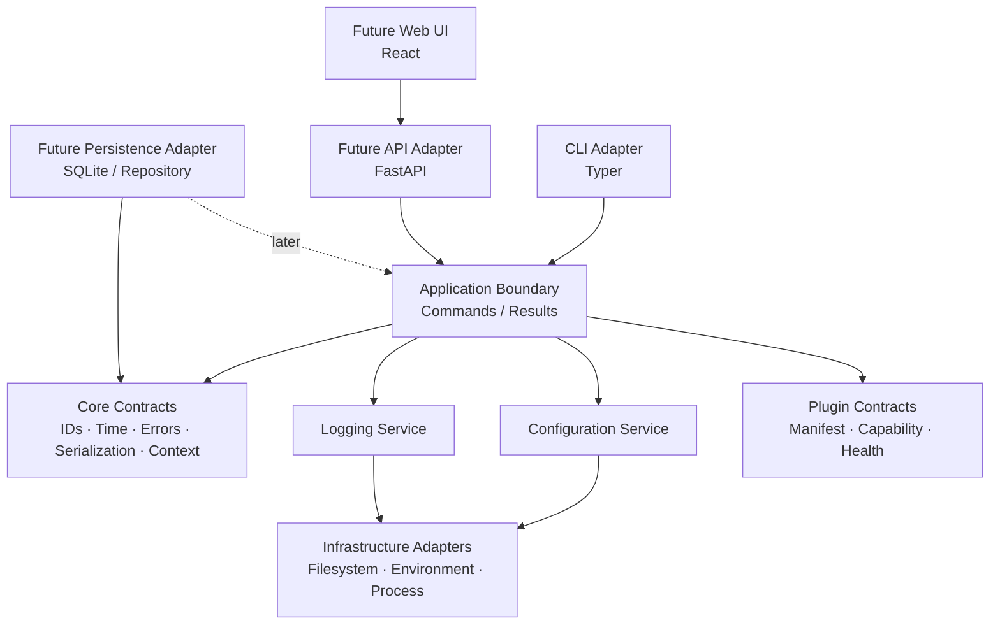

# CyberOS — Module 0.1

## Bootstrap & Core Contracts

**الحالة:** منفّذ ومجتاز لفحوصات الجودة الأولية  
**الإصدار:** 0.1.0  
**المالك:** CyberOS  
**نطاق الوثيقة:** نواة التشغيل والعقود المشتركة فقط

---

## 1. الملخص التنفيذي

### حالة التنفيذ

تم تنفيذ النطاق المعتمد في الحزمة `cyberos-core/`. تشمل النتيجة الحالية core contracts، typed errors، TOML configuration، environment overrides، structured logging setup، CLI، doctor checks، plugin contracts، الاختبارات، وquality gates. لم تتم إضافة Database أو HTTP API أو Web UI أو أي تشغيل لأدوات Cybersecurity.

يهدف Module 0.1 إلى إنشاء نواة صغيرة وقابلة للاختبار تضع القواعد المشتركة التي ستستخدمها جميع وحدات CyberOS اللاحقة. هذه الوحدة لا تنفذ Recon أو Pentesting أو Evidence أو Findings، ولا تنشئ قاعدة البيانات أو واجهة الويب. بدلًا من ذلك، تنشئ الحدود التي تمنع الوحدات المستقبلية من اختراع طرق مختلفة للتعامل مع الإعدادات، الأخطاء، السجلات، المعرّفات، التواريخ، serialization، ونتائج الأوامر.

الفكرة الأساسية هي أن نبدأ بـ **قلب تقني صغير بلا منطق Cybersecurity**، لكن قابل للاستخدام فعليًا من خلال أوامر CLI بسيطة. بهذه الطريقة نختبر طريقة التغليف، التشغيل، تسجيل الأحداث، إدارة الإعدادات، واختبارات الجودة قبل أن تصبح المنظومة معقدة.

> Module 0.1 ليس منتج Cybersecurity مستقلًا؛ هو عقد التشغيل المشترك الذي ستبني فوقه الوحدات القادمة.

---

## 2. قرار معماري مهم قبل التنفيذ

البيئة الحالية التي تم فتحها هي مشروع **React web-static**، وهي مناسبة لواجهة مستخدم ثابتة، لكنها لا توفر وحدها CLI حقيقيًا أو SQLite أو API خلفيًا أو تشغيل أدوات محلية. لذلك لن نضع منطق CyberOS الأساسي داخل الواجهة الأمامية، ولن نستخدم الواجهة كبديل عن النواة.

التصميم المقترح يفصل بين نواة محلية مكتوبة بلغة Python وواجهة الويب التي ستضاف لاحقًا كعميل اختياري. هذا الاختيار يخدم مسارك في Python وData وML، ويجعل تشغيل الأدوات المحلية والـadapters المستقبلية طبيعيًا، مع إبقاء Web UI طبقة عرض لا تملك منطق المجال.

### القرار المقترح

| الطبقة | التقنية المقترحة | دورها في Module 0.1 |
|---|---|---|
| Core runtime | Python 3.11+ | تشغيل العقود والمنطق المشترك |
| CLI | Typer | أوامر `version` و`doctor` و`config show` |
| Validation | Pydantic v2 | نماذج الإعدادات والعقود القابلة للتحقق |
| Logging | `logging` مع `structlog` | سجلات منظمة مع correlation ID |
| Configuration | TOML + environment overrides | إعدادات قابلة للقراءة دون وضع الأسرار في المستودع |
| Serialization | JSON | مخرجات CLI والعقود بين الطبقات |
| Testing | pytest | اختبارات الوحدة والعقود وCLI smoke tests |
| Quality | Ruff + mypy | تنسيق، linting، وفحص الأنواع |
| Packaging | `pyproject.toml` + uv lock | تثبيت قابل للتكرار |
| Web UI | مؤجلة | لا تدخل Module 0.1 |
| Database | مؤجلة إلى Module 0.2 | لا نثبت schema قبل تثبيت العقود الأساسية |

### قرارات تحتاج اعتمادًا صريحًا

1. اعتماد Python كنواة النظام بدل وضع النواة في React/Node.
2. اعتماد UUID4 في البداية للمعرّفات، مع ترك باب الانتقال إلى UUID7 أو ULID مفتوحًا إذا ظهرت حاجة فعلية للترتيب الزمني.
3. اعتماد TOML للإعدادات البشرية وJSON للتبادل والمخرجات.
4. إبقاء Module 0.1 بلا قاعدة بيانات وبلا API HTTP؛ سيتم بناء ذلك في وحدات مستقلة بعد تثبيت النواة.

---

## 3. الأهداف

يجب أن تحقق الوحدة الأهداف الآتية:

| الهدف | معيار النجاح |
|---|---|
| تشغيل المشروع | يمكن تثبيت الحزمة وتشغيل CLI من بيئة نظيفة |
| قابلية التشخيص | الأمر `doctor` يعطي نتيجة مفهومة للبشر وJSON للبرامج |
| إعدادات موحدة | كل وحدة لاحقة تقرأ الإعدادات من نفس المصدر وبنفس قواعد الأولوية |
| سجلات قابلة للتتبع | كل عملية لها correlation ID ولا تظهر فيها أسرار |
| أخطاء موحدة | كل خطأ قابل للتصنيف وله code ودرجة retryability وexit code |
| عقود مستقرة | المعرّفات والتواريخ والنتائج وserialization لها شكل موحد |
| قابلية الاختبار | الاختبارات تعمل دون شبكة أو أدوات خارجية أو أهداف حقيقية |
| قابلية التوسع | يمكن إضافة API وDatabase وPlugins دون كسر النواة |

---

## 4. ما الذي لا تفعله الوحدة

حتى لا يتضخم النطاق، لا تحتوي هذه الوحدة على:

| خارج النطاق | سبب الاستبعاد |
|---|---|
| Recon أو scanning | أول Cybersecurity capability ستأتي في Module 1 بعد اكتمال الأساس |
| تنفيذ subprocess لأدوات خارجية | نحتاج أولًا إلى Plugin contract مستقل وآمن |
| SQLite أو migrations | ستكون Module 0.2 مع persistence contract واضح |
| HTTP API | ستكون طبقة نقل فوق application services وليست جزءًا من bootstrap |
| Web UI حقيقية | الواجهة لا يجب أن تقود تصميم النواة |
| إدارة المستخدمين والصلاحيات | النظام Local-first في البداية، ويضاف auth عند ظهور حاجة حقيقية |
| تخزين الأسرار | لا نريد بناء secret vault ناقصًا؛ نستخدم environment فقط مؤقتًا مع redaction |
| تحميل plugins تلقائيًا وتشغيلها | Module 0.1 يعرّف العقد فقط، ولا يفتح سطح تنفيذ غير ضروري |
| business entities مثل Target وFinding | ستدخل في وحدات domain منفصلة بعد persistence design |

---

## 5. المعمارية المقترحة

نستخدم معمارية طبقية مع قاعدة dependency واحدة: **الطبقات الداخلية لا تعرف CLI أو Web أو filesystem**.



### الطبقات

#### 5.1 Core Contracts

تحتوي على الأنواع والقواعد التي لا تعتمد على framework أو نظام تشغيل. تشمل `EntityId`، الوقت UTC، `CorrelationId`، `OperationResult`، `ErrorEnvelope`، serialization، وواجهات plugin المجردة.

#### 5.2 Application Boundary

تحتوي على عمليات صغيرة مثل `GetVersion` و`RunDoctor` و`ShowConfig`. هذه الطبقة تنسق التنفيذ لكنها لا تعرف تفاصيل Click/Typer أو HTTP.

#### 5.3 Infrastructure

تغلف الوصول إلى environment والملفات وfilesystem وruntime. الهدف هو جعل الاختبارات تستخدم fake adapters بدل القراءة من جهاز المستخدم.

#### 5.4 Interface Adapters

في Module 0.1 يوجد CLI فقط. API وWeb UI مؤجلان، لكن العقود مصممة بحيث يستدعيهما لاحقًا نفس application boundary بدل تكرار المنطق.

---

## 6. Folder Structure المقترح

```text
cyberos/
├── pyproject.toml
├── uv.lock
├── README.md
├── LICENSE
├── .gitignore
├── .env.example
├── config/
│   └── cyberos.example.toml
├── docs/
│   ├── architecture/
│   │   ├── module-0.1-bootstrap-core-contracts.md
│   │   └── decisions/
│   └── development/
├── src/
│   └── cyberos/
│       ├── __init__.py
│       ├── __main__.py
│       ├── cli/
│       │   ├── __init__.py
│       │   ├── app.py
│       │   └── output.py
│       ├── application/
│       │   ├── __init__.py
│       │   ├── version.py
│       │   ├── doctor.py
│       │   └── config_commands.py
│       ├── core/
│       │   ├── __init__.py
│       │   ├── ids.py
│       │   ├── time.py
│       │   ├── result.py
│       │   ├── errors.py
│       │   ├── context.py
│       │   ├── serialization.py
│       │   └── plugins.py
│       ├── config/
│       │   ├── __init__.py
│       │   ├── models.py
│       │   ├── loader.py
│       │   └── redaction.py
│       ├── logging/
│       │   ├── __init__.py
│       │   ├── setup.py
│       │   └── formatters.py
│       └── infrastructure/
│           ├── __init__.py
│           ├── environment.py
│           ├── filesystem.py
│           └── runtime.py
├── tests/
│   ├── unit/
│   ├── contract/
│   ├── integration/
│   └── cli/
├── scripts/
│   └── check.sh
└── docker/
    └── Dockerfile.dev
```

### قاعدة تنظيم مهمة

لا نضع business model في `core/` لمجرد أنه مشترك. `core/` يحتوي primitives وعقودًا عامة فقط. أما `Workspace` و`Target` و`Finding` فلكل منها module domain مستقل عندما نصل إلى مرحلته.

---

## 7. Core Data Contracts

### 7.1 المعرّفات

كل معرّف يعرض كسلسلة نصية canonical lowercase، ويُنشأ عند حدود النظام وليس داخل كل طبقة بطريقة مختلفة.

```json
{
  "id": "7f3f9e4b-6b8a-4a5f-9e38-6a74d7c6d5b1",
  "kind": "operation"
}
```

سنستخدم UUID4 في هذه المرحلة. لا يعتمد أي كود لاحق على شكل UUID4 بشكل يجعل الانتقال إلى نوع آخر مستحيلًا.

### 7.2 الوقت

كل timestamp داخلي يكون timezone-aware وبصيغة UTC. لا نسمح بـnaive datetime. العرض المحلي للمستخدم مسؤولية طبقة العرض فقط.

### 7.3 سياق العملية

كل command يحصل على سياق موحد:

```json
{
  "correlation_id": "c9a8c6e2-5e1a-4d71-b3b9-54bb69ac7a04",
  "operation_id": "2e1d5a1a-1ff4-4a8f-b93a-e7ad79df9b31",
  "actor": "local-user",
  "environment": "development"
}
```

`actor` لا يعني وجود authentication الآن؛ هو حقل تمهيدي للتدقيق audit عندما تضاف الصلاحيات لاحقًا.

### 7.4 نتيجة العملية

بدل أن تعيد كل طبقة شكلًا مختلفًا، تستخدم الحدود الخارجية envelope موحدًا:

```json
{
  "ok": true,
  "data": {
    "name": "cyberos",
    "version": "0.1.0"
  },
  "meta": {
    "correlation_id": "c9a8c6e2-5e1a-4d71-b3b9-54bb69ac7a04",
    "duration_ms": 4
  }
}
```

### 7.5 خطأ العملية

```json
{
  "ok": false,
  "error": {
    "code": "CONFIG_INVALID",
    "message": "Configuration validation failed.",
    "details": {
      "field": "data_dir"
    },
    "retryable": false,
    "severity": "error"
  },
  "meta": {
    "correlation_id": "c9a8c6e2-5e1a-4d71-b3b9-54bb69ac7a04"
  }
}
```

الرسالة المعروضة للمستخدم لا تحتوي على stack trace أو secret أو مسار حساس إلا عند طلب وضع debug صراحة.

---

## 8. Error Taxonomy

يجب أن تكون الأخطاء قابلة للتمييز آليًا، لا مجرد نصوص.

| الفئة | أمثلة codes | retryable | exit code المقترح |
|---|---|---:|---:|
| Configuration | `CONFIG_NOT_FOUND`, `CONFIG_INVALID` | لا | 2 |
| Environment | `RUNTIME_UNSUPPORTED`, `PATH_NOT_WRITABLE` | غالبًا لا | 3 |
| Serialization | `SERIALIZATION_FAILED`, `INVALID_INPUT` | لا | 4 |
| Plugin contract | `PLUGIN_MANIFEST_INVALID` | لا | 5 |
| Internal | `INTERNAL_ERROR` | غير معروف | 10 |
| Cancelled | `OPERATION_CANCELLED` | حسب السياق | 130 |

قاعدة مهمة: لا نكشف تفاصيل الخطأ الداخلي للمستخدم العادي، لكن نسجل event داخليًا مع correlation ID ونوفر طريقة للوصول إلى log عند الحاجة.

---

## 9. Configuration Design

### مصادر الإعدادات وترتيب الأولوية

من الأقل إلى الأعلى أولوية:

1. القيم الافتراضية الآمنة داخل الكود.
2. ملف TOML اختياري.
3. متغيرات environment باسم `CYBEROS_*`.
4. خيارات CLI الصريحة، إذا كان الأمر يدعمها.

لا نستخدم `.env` تلقائيًا في الإنتاج. يمكن توفير `.env.example` للتطوير فقط، ولا يدخل إلى Git أي secret حقيقي.

### إعدادات Module 0.1

```toml
[app]
name = "cyberos"
environment = "development"

[runtime]
data_dir = "~/.cyberos"
log_dir = "~/.cyberos/logs"
log_level = "INFO"
log_format = "text"

[cli]
output_format = "text"
color = true
```

### قواعد الأمان

يجب أن تكون القيم الحساسة مستقبلًا مصنفة كـsecret ولا تظهر في `config show`. Module 0.1 لا يخزن secrets ولا يطبع environment كاملًا. يعرض `config show --redacted` فقط القيم المسموح بها.

---

## 10. Logging Design

نستخدم logging منظمًا مع حقول ثابتة:

```json
{
  "timestamp": "2026-08-13T18:30:00.000Z",
  "level": "INFO",
  "event": "doctor.completed",
  "logger": "cyberos.application.doctor",
  "correlation_id": "c9a8c6e2-5e1a-4d71-b3b9-54bb69ac7a04",
  "duration_ms": 12,
  "checks_passed": 5,
  "checks_failed": 0
}
```

في terminal نستخدم صيغة مقروءة، وفي `--json` أو عند `log_format=json` نستخدم JSON Lines. لا نسجل command arguments كاملة إذا كان من المحتمل أن تحتوي على secrets.

### مستويات السجل

| المستوى | الاستخدام |
|---|---|
| DEBUG | تفاصيل المطور عند التشخيص فقط |
| INFO | بداية ونهاية عمليات مهمة |
| WARNING | حالة غير مثالية دون فشل العملية |
| ERROR | فشل عملية قابل للعرض والتشخيص |
| CRITICAL | فشل يمنع تشغيل النواة أو خطر سلامة واضح |

---

## 11. CLI Contract

### الأوامر التي تدخل Module 0.1

```text
cyberos version
cyberos doctor
cyberos doctor --json
cyberos config show
cyberos config show --redacted
cyberos config validate --file ./cyberos.toml
```

### سلوك الأوامر

| الأمر | النجاح | الفشل |
|---|---|---|
| `version` | يطبع اسم الحزمة والإصدار وPython runtime | خطأ تشغيل واضح |
| `doctor` | يفحص runtime والإعدادات والمسارات والserialization | exit code غير صفري مع قائمة checks |
| `doctor --json` | envelope JSON صالح للـCI والبرامج | JSON error envelope حتى في الفشل |
| `config show` | يعرض الإعدادات غير الحساسة | يمنع عرض القيم المصنفة سرية |
| `config validate` | يتحقق دون إنشاء ملفات أو تغيير حالة | يحدد الحقل وقاعدة الفشل |

لا يوجد في هذه الوحدة أمر ينفذ scan أو subprocess أو اتصالًا بأهداف خارجية.

---

## 12. Plugin Contract — تعريف فقط

لأن الوحدات المستقبلية ستحتاج adapters، نعرّف contract أوليًا دون تحميل أو تنفيذ plugins الآن.

```python
class PluginProtocol(Protocol):
    def manifest(self) -> PluginManifest: ...
    def validate_config(self, config: Mapping[str, Any]) -> ValidationResult: ...
    def healthcheck(self) -> HealthResult: ...
```

ويحتوي `PluginManifest` على:

```json
{
  "plugin_id": "example.adapter",
  "name": "Example Adapter",
  "version": "0.1.0",
  "api_version": "0.1",
  "capabilities": ["healthcheck"],
  "requires_network": false,
  "requires_subprocess": false
}
```

لا يُسمح للـmanifest بتشغيل أي كود. التنفيذ، sandboxing، allowlist، timeouts، وresource limits تؤجل إلى Module Plugin Registry وModule Recon Adapter.

---

## 13. Application Flows

### 13.1 `doctor`

```text
CLI input
  → create correlation context
  → load safe configuration
  → run independent checks
  → collect CheckResult objects
  → normalize into OperationResult
  → render text or JSON
  → emit completion log
```

### 13.2 فشل إعدادات

```text
invalid TOML/environment
  → ConfigLoader raises typed error
  → boundary maps error to CONFIG_INVALID
  → CLI prints safe message
  → process exits with code 2
  → log stores correlation_id and field name only
```

### 13.3 Future API integration

عندما نضيف API، لا يعيد FastAPI تنفيذ `doctor` أو parsing الإعدادات. يستدعي application service نفسه ويحوّل `OperationResult` إلى HTTP response. بهذه الطريقة لا توجد نسختان من منطق النظام.

---

## 14. Testing Strategy

### طبقات الاختبار

| الطبقة | ما تختبره | اعتماد خارجي |
|---|---|---|
| Unit | IDs، time، errors، serialization، config validation | لا شيء |
| Contract | شكل success/error/plugin manifests | لا شيء |
| Infrastructure | قراءة environment والملفات والمسارات | temporary filesystem فقط |
| CLI smoke | الأوامر exit codes والمخرجات | subprocess محلي للـCLI فقط |
| Security | redaction، عدم تسريب secrets، path handling | لا شبكة |
| Integration | wiring بين loader وdoctor وCLI | بيئة temporary معزولة |

### الحالات الأساسية

يجب أن تغطي الاختبارات على الأقل:

1. تشغيل `version` مع إعدادات افتراضية.
2. تشغيل `doctor` في بيئة سليمة.
3. فشل `doctor` عند مسار غير قابل للكتابة.
4. ملف TOML مفقود، مع السماح بالغياب عندما يكون اختياريًا.
5. TOML غير صالح.
6. environment override صحيح.
7. environment override غير صالح نوعيًا.
8. serialization لـUUID وUTC datetime.
9. redaction لقيمة تحمل اسمًا حساسًا.
10. عدم ظهور قيمة سرية في stdout أو stderr أو log capture.
11. JSON output صالح حتى عند الفشل.
12. correlation ID ثابت داخل عملية واحدة ومختلف بين عمليتين.
13. plugin manifest غير صالح يرفض قبل التسجيل.
14. عدم تنفيذ network أو subprocess في أي test من Module 0.1.

### Quality gates

لا تعتبر الوحدة مكتملة إلا إذا نجحت:

```text
pytest
ruff check .
ruff format --check .
mypy src
python -m build
```

وسيتم إضافة أمر واحد موحد مثل `./scripts/check.sh` لتشغيل الفحوصات بطريقة قابلة للتكرار.

---

## 15. Security Model

Module 0.1 لا ينفذ عمليات هجومية، لكن يجب أن يؤسس عادات صحيحة:

| الخطر | المعالجة |
|---|---|
| تسريب secrets في logs | redaction مركزي واختبارات regression |
| تحميل config من مكان غير متوقع | مسار صريح وقواعد واضحة للأولوية |
| الكتابة خارج data directory | التحقق من المسارات قبل إنشاء الملفات |
| symlink/path traversal | لا توجد عمليات file write عامة في Module 0.1، وأي write محدود إلى runtime directories |
| أخطاء غير مفهومة | typed errors وcorrelation IDs بدل stack traces للمستخدم |
| اعتماديات غير قابلة للتكرار | lockfile وفحوصات CI |
| تنفيذ plugin غير موثوق | لا يوجد execution في هذه الوحدة |
| اختلاف التوقيت | UTC داخليًا ورفض naive datetime |
| خروج بيانات حساسة من `config show` | redacted view افتراضيًا عند إضافة secrets مستقبلًا |

### مبدأ الخصوصية

لا توجد اتصالات خارجية، ولا telemetry، ولا analytics، ولا إرسال بيانات إلى خدمة سحابية من Module 0.1. أي اتصال مستقبلي يجب أن يكون feature صريحًا ومغلقًا افتراضيًا.

---

## 16. Documentation Deliverables

بعد التنفيذ يجب أن تحتوي الوحدة على:

| الملف | الغرض |
|---|---|
| `README.md` | التثبيت والتشغيل السريع |
| `docs/architecture/module-0.1-...md` | هذا التصميم مع تحديث حالة التنفيذ |
| `docs/development/testing.md` | تشغيل الاختبارات وquality gates |
| `docs/decisions/ADR-0001-runtime.md` | قرار Python والنواة المحلية |
| `docs/decisions/ADR-0002-config.md` | قرار TOML وenvironment overrides |
| `.env.example` | أسماء المتغيرات دون أسرار |
| `config/cyberos.example.toml` | مثال آمن للإعدادات |

كل مثال يجب أن يكون قابلًا للنسخ دون أن يشير إلى هدف حقيقي أو secret حقيقي.

---

## 17. Definition of Done

تعتبر Module 0.1 منجزة فقط عند تحقق جميع النقاط الآتية:

1. تثبيت الحزمة في بيئة نظيفة بنجاح.
2. تشغيل `cyberos version` وإخراج نتيجة ثابتة.
3. تشغيل `cyberos doctor` وإظهار checks مفهومة.
4. تشغيل `cyberos doctor --json` وإخراج JSON صالح في النجاح والفشل.
5. تحميل إعدادات TOML وenvironment وفق ترتيب الأولوية الموثق.
6. وجود typed error taxonomy وexit codes موثقة.
7. وجود structured logging مع correlation ID وredaction.
8. وجود core contracts موثقة ومختبرة.
9. وجود plugin contract دون تنفيذ plugins.
10. نجاح unit، contract، CLI، security، وintegration tests.
11. نجاح lint وformat وtype checking وpackage build.
12. عدم وجود اتصالات شبكة أو عمليات scanning أو تخزين secrets.
13. توثيق القرارات والحدود والمشاكل المتبقية.

---

## 18. ما بعد Module 0.1

الوحدة التالية المقترحة هي **Module 0.2 — Persistence Kernel**. ستضيف SQLite وmigration strategy وrepository interfaces، لكنها ستستخدم عقود Module 0.1 بدل تعريفها من جديد. بعدها يأتي **Module 0.3 — Workspace & Engagement** كأول vertical slice له قيمة مباشرة للمستخدم.

لا ننتقل إلى Recon قبل أن تصبح هذه السلسلة مستقرة:

```text
0.1 Bootstrap & Contracts
  → 0.2 Persistence Kernel
    → 0.3 Workspace & Engagement
      → 0.4 Target & Scope
        → 0.5 Task & Job Runtime
          → Plugin Registry
            → Recon Adapter
```

---

## 19. قرار الاعتماد المطلوب

قبل التنفيذ أحتاج اعتمادك على هذه القرارات الأربعة:

| القرار | المقترح |
|---|---|
| لغة النواة | Python 3.11+ |
| شكل المشروع | Python core مستقل منطقيًا عن React web shell |
| الإعدادات | TOML + environment overrides، وJSON للمخرجات |
| نطاق Module 0.1 | Bootstrap، contracts، CLI، config، logging، errors، tests، docs فقط؛ بلا DB/API/UI/business entities |

بعد اعتمادها سأبدأ التنفيذ الفعلي، وسأعرض لك أولًا قائمة الملفات التي ستُنشأ ثم أطبق الوحدة وأشغل الاختبارات بدل إضافة ميزات خارج النطاق.

---

## References

لا تعتمد هذه الوثيقة على مصادر خارجية؛ وهي تمثل قرارات تصميمية مقترحة لمشروع CyberOS وتحتاج اعتماد صاحب المشروع قبل التنفيذ.
