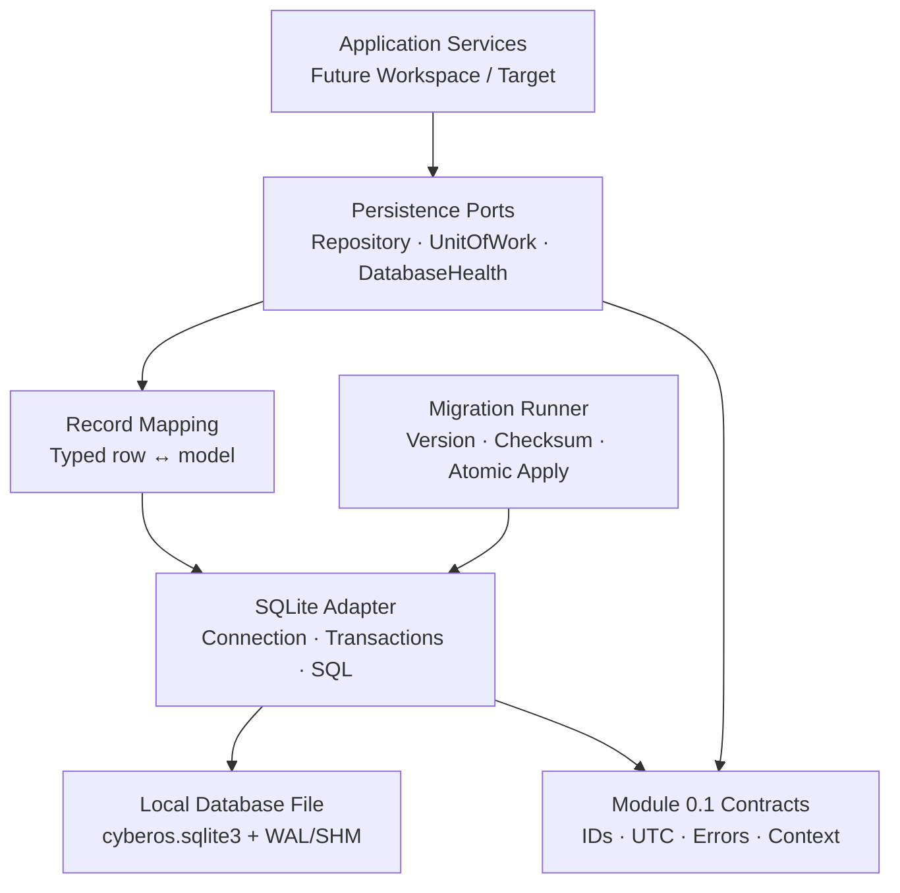

# CyberOS — Module 0.2

## Persistence Kernel

**الحالة:** Module 0.2 مغلق؛ 0.2.a إلى 0.2.e منفّذة ومختبرة  
**الإصدار المقترح:** 0.2.0  
**يعتمد على:** Module 0.1 — Bootstrap & Core Contracts  
**النطاق:** SQLite محلية، migrations، connection lifecycle، transaction boundary، وrepository contracts

---

## 1. الملخص التنفيذي

### حالة التنفيذ

تم تنفيذ وإغلاق الأجزاء الفرعية **0.2.a** إلى **0.2.e** داخل `cyberos-core/`. أضيفت transaction boundary صريحة مع commit وrollback وisolation tests، Repository Ports مستقلة عن SQL، وDatabaseHealthReport يعكس schema version وPRAGMA state وquick_check. لا توجد Domain Tables؛ وستدخل فقط بعد اعتماد تصميم Module 0.3.

يضيف Module 0.2 طبقة persistence محلية وقابلة للاختبار فوق عقود Module 0.1. الغرض ليس إنشاء جداول Workspace أو Target أو Finding الآن؛ بل بناء **محرك تخزين صغير ومستقر** تستطيع الوحدات القادمة استخدامه دون إعادة اختراع طريقة فتح قاعدة البيانات، إدارة المعاملات، تطبيق migrations، أو التعامل مع أخطاء SQLite.

الاختيار المقترح هو استخدام `sqlite3` من Python Standard Library بدل إدخال ORM في هذه المرحلة. هذا يقلل الاعتماديات، يجعل السلوك واضحًا وقابلًا للمراجعة، ويمنحنا تحكمًا مباشرًا في `PRAGMA`، المعاملات، وmigrations. ستُعرّف repositories كواجهات مستقلة عن SQLite، بينما يكون التنفيذ الحالي SQLite-specific adapter.

> Persistence Kernel يجب أن يحمي البيانات ويثبت سلوك التخزين، لكنه لا يجب أن يعرف معنى Workspace أو Target أو Finding.

---

## 2. نطاق الوحدة

### ما ستفعله

| المجال | النتيجة المقترحة |
|---|---|
| Database location | مسار محلي افتراضي تحت `~/.cyberos/cyberos.sqlite3` مع إمكانية override من config |
| Connection lifecycle | إنشاء اتصال، تهيئة آمنة، timeout، وإغلاق حتمي |
| SQLite hardening | foreign keys، busy timeout، WAL، synchronous، secure delete، وفحص integrity |
| Schema versioning | جدول داخلي لتتبع migration version وchecksum |
| Migration runner | تطبيق migrations مرتبة وبشكل ذري مع منع التعديل الصامت على migration مطبقة |
| Transactions | `UnitOfWork` واضح مع commit/rollback وعدم تسريب اتصال خام للطبقات العليا |
| Repository contracts | interfaces عامة للعمليات وتخزين domain records مستقبلًا |
| Error mapping | تحويل أخطاء SQLite إلى typed errors من Module 0.1 |
| Contract tests | اختبارات يمكن تشغيلها على أي backend يلتزم بالعقد، مع SQLite implementation كاختبار أول |
| Integrity checks | `quick_check` أو `integrity_check` وقراءة حالة schema |

### ما لن تفعله

لا تحتوي الوحدة على جداول المجال الخاصة بـWorkspace أو Engagement أو Target أو Finding أو Evidence، ولا تنفذ API أو user authentication أو encryption كامل للبيانات أو backup scheduler أو replication أو multi-user server database. هذه الحدود مقصودة حتى لا يتحول persistence kernel إلى domain module ضخم.

---

## 3. القرارات المعمارية المقترحة

| القرار | المقترح | السبب |
|---|---|---|
| SQLite driver | `sqlite3` من Python Standard Library | أقل اعتماديات وتحكم مباشر وسلوك واضح |
| ORM | لا ORM في 0.2 | لا توجد domain entities بعد، وإدخاله الآن يرفع التعقيد بلا قيمة متناسبة |
| Migration tool | runner داخلي صغير بملفات SQL versioned | يكفي لقاعدة محلية ويجعل checksum والسياسة واضحين |
| Migration direction | forward-only في التشغيل العادي | downgrade الآلي قد يسبب فقدان بيانات صامتًا |
| Default journal | WAL | يسمح بقراءات متزامنة أفضل ويقلل حجز القارئ للكاتب |
| Durability | `synchronous=FULL` افتراضيًا | الأولوية لسلامة البيانات على الأداء في النواة |
| Foreign keys | مفعّلة لكل اتصال | SQLite لا يضمنها افتراضيًا في كل سياق |
| Encryption | غير مفعّلة في 0.2 | SQLite القياسية لا تعني تشفيرًا؛ لا نريد إعطاء إحساس أمان زائف |
| Repository SQL | SQL ثابت داخل adapters، لا table/column identifiers من user input | منع SQL injection على مستوى تصميم الواجهة |
| Connection exposure | لا نعيد `sqlite3.Connection` إلى domain code | إبقاء PRAGMA والمعاملات تحت سيطرة kernel |

### قرارات تحتاج اعتمادًا

1. استخدام `sqlite3` وSQL صريح بدل ORM.
2. اعتماد migrations forward-only وعدم دعم downgrade تلقائي.
3. استخدام WAL مع `synchronous=FULL` و`foreign_keys=ON` كإعداد افتراضي.
4. إبقاء encryption وbackup automation خارج 0.2، مع توفير extension points واضحة.

---

## 4. المعمارية الطبقية



### حدود الاعتماد

الطبقة الداخلية `ports` لا تعرف SQLite. الـSQLite adapter يطبّق interfaces ولا يفرضها على التطبيق. migration runner يعرف database connection protocol فقط، وليس domain models. أي domain module لاحق يضيف repository خاصًا به داخل حدوده، ويستخدم `UnitOfWork` وconnection provider من kernel.

---

## 5. Folder Structure المقترح

```text
cyberos-core/
├── src/cyberos/
│   ├── persistence/
│   │   ├── __init__.py
│   │   ├── ports.py
│   │   ├── models.py
│   │   ├── errors.py
│   │   ├── connection.py
│   │   ├── transactions.py
│   │   ├── health.py
│   │   ├── migrations/
│   │   │   ├── __init__.py
│   │   │   ├── runner.py
│   │   │   ├── loader.py
│   │   │   └── versions/
│   │   │       └── 0001_persistence_kernel.sql
│   │   └── sqlite/
│   │       ├── __init__.py
│   │       ├── adapter.py
│   │       ├── transaction.py
│   │       └── repositories.py
│   └── config/
│       └── models.py  # إضافة database settings
├── tests/
│   ├── contract/
│   │   ├── test_repository_contract.py
│   │   ├── test_transaction_contract.py
│   │   └── test_migration_contract.py
│   ├── integration/
│   │   ├── test_sqlite_connection.py
│   │   ├── test_sqlite_migrations.py
│   │   └── test_sqlite_integrity.py
│   └── security/
│       └── test_sqlite_hardening.py
├── docs/development/
│   └── persistence.md
└── config/
    └── cyberos.example.toml  # إضافة [database]
```

لن نضع domain tables في `0001_persistence_kernel.sql`. ستحتوي migration الأولى على metadata الخاصة بالـkernel فقط، مما يثبت آلية migrations دون سرقة مسؤولية الوحدات القادمة.

---

## 6. Database Location وConfiguration

### إعدادات جديدة

```toml
[database]
path = "~/.cyberos/cyberos.sqlite3"
timeout_seconds = 5.0
journal_mode = "wal"
synchronous = "full"
foreign_keys = true
secure_delete = true
create_parent = true
```

المسار الافتراضي local-first. يدعم الاختبار تمرير `:memory:` أو temporary file من خلال dependency injection، لكن لا يُسمح أن يتسرب هذا الاختيار إلى production configuration دون قصد.

### ترتيب الأولوية

يظل ترتيب Module 0.1 كما هو: defaults، ثم TOML، ثم `CYBEROS_*` environment overrides، ثم خيارات CLI إن أضيفت. أسماء Module 0.2 المقترحة هي `CYBEROS_DATABASE_PATH` و`CYBEROS_DATABASE_TIMEOUT_SECONDS` و`CYBEROS_DATABASE_JOURNAL_MODE`.

### عدم تخزين الأسرار

مسار قاعدة البيانات ليس secret. أما أي مستقبل يضيف key أو passphrase فلا يُخزّن داخل TOML أو SQLite تلقائيًا، بل يحتاج secret-management decision منفصل.

---

## 7. Connection Lifecycle وSQLite Hardening

كل اتصال ينشأ عبر `ConnectionFactory` واحدة، وتُطبّق الإعدادات نفسها عند الإنشاء. لن تنشئ repositories اتصالات خاصة بها.

### PRAGMA policy المقترحة

```sql
PRAGMA foreign_keys = ON;
PRAGMA busy_timeout = 5000;
PRAGMA journal_mode = WAL;
PRAGMA synchronous = FULL;
PRAGMA secure_delete = ON;
```

`journal_mode` و`synchronous` يجب أن يمرّا عبر allowlist وليس من خلال SQL نصي عشوائي. في الاختبارات يمكن استخدام `journal_mode=memory` فقط عندما يكون ذلك جزءًا صريحًا من fixture. يجب تسجيل effective settings في debug log دون تسجيل محتوى البيانات.

### File permissions

عند إنشاء قاعدة جديدة، ينشئ kernel parent directory بصلاحية مقيدة للمستخدم الحالي، ثم يضبط ملف قاعدة البيانات على `0600` حيث تسمح المنصة. لا يُفترض أن هذا تشفير؛ إنه تقليل للوصول العرضي على نظام التشغيل. إذا كان الملف موجودًا وpermissions أوسع من السياسة، تكون النتيجة WARNING أو failure بحسب إعداد security policy، ولا يتم تغيير ملكية ملف لم ينشئه CyberOS بصمت.

### Symlink وpath policy

الإعداد الافتراضي لا يقبل path غير متوقع أو directory غير قابل للكتابة. لا نحتاج إلى resolve symlink بشكل عدواني في كل بيئة، لكن يجب منع إنشاء parent عبر symlink غير موثوق في المسار الافتراضي. أي خيار `allow_external_path` سيكون قرارًا منفصلًا ولن يُضاف تلقائيًا.

### Integrity checks

يوفر kernel عملية health check تستخدم `PRAGMA quick_check`. ويمكن توفير `integrity_check` كأمر أبطأ عند طلب المستخدم. لا تُشغّل عمليات الإصلاح التلقائي؛ عند اكتشاف corruption نوقف الكتابة ونحافظ على الملف للتحليل والنسخ الاحتياطي.

---

## 8. Migration Strategy

### Migration metadata

الجدول الداخلي المقترح:

```sql
CREATE TABLE IF NOT EXISTS schema_migrations (
    version INTEGER PRIMARY KEY,
    name TEXT NOT NULL,
    checksum TEXT NOT NULL,
    applied_at TEXT NOT NULL,
    execution_ms INTEGER NOT NULL
);
```

الـchecksum هو SHA-256 لمحتوى ملف migration بعد normalization محدد. لا نعيد تطبيق migration مطبقة إذا تطابق version والchecksum. إذا اختلف checksum لنفس version، يفشل التشغيل برسالة typed مثل `MIGRATION_CHECKSUM_MISMATCH`؛ لا يوجد تعديل صامت.

### طريقة التطبيق

```text
open connection
  → apply safe PRAGMA
  → BEGIN IMMEDIATE
  → create schema_migrations if missing
  → discover ordered migration files
  → compare version/checksum
  → apply each pending migration
  → insert metadata row
  → COMMIT
  → run quick_check
```

كل migration تُطبق في transaction. إذا فشل SQL أو checksum أو ترتيب الملفات، يحدث rollback للعملية كاملة. لا نترك قاعدة في حالة نصف migration.

### السياسة الزمنية

يجب أن يكون لكل migration integer version padded مثل `0001`, `0002`. لا تعتمد الترتيب على وقت الملف أو اسم غير منضبط. لا نحذف migration قديمة من المستودع بعد تطبيقها؛ لأنها جزء من تاريخ schema.

### Downgrade

لا ندعم downgrade تلقائيًا في الإنتاج. عند الحاجة إلى التراجع، نستخدم backup/restore موثقًا أو migration forward جديدة. يمكن أن توجد fixtures reset للتطوير، لكنها لا تعمل على ملف production دون flag صريح وحماية إضافية.

### Migration الأولى

`0001_persistence_kernel.sql` تنشئ `schema_migrations` فقط أو metadata الضرورية للـrunner. لن تنشئ جداول business domain. هذا يجعل 0.2 قابلة للاختبار دون اتخاذ قرارات مبكرة حول Workspace schema.

---

## 9. Repository Interfaces

نريد interfaces تفيد الوحدات القادمة دون أن تجبرها على generic abstraction هش.

### Unit of Work

```python
class UnitOfWork(Protocol):
    def __enter__(self) -> "UnitOfWork": ...
    def __exit__(self, exc_type, exc_value, traceback) -> None: ...
    def commit(self) -> None: ...
    def rollback(self) -> None: ...
```

السلوك الافتراضي هو rollback عند خروج context بوجود exception، وcommit صريح عند النجاح. لا نعمل auto-commit بعد كل repository operation؛ ذلك يقتل atomicity بين عدة تغييرات.

### Repository Port

```python
class Repository(Protocol[RecordT]):
    def get(self, entity_id: EntityId) -> RecordT | None: ...
    def add(self, record: RecordT) -> RecordT: ...
    def update(self, record: RecordT) -> RecordT: ...
    def delete(self, entity_id: EntityId) -> bool: ...
    def exists(self, entity_id: EntityId) -> bool: ...
```

هذه العمليات لا تحدد table name أو SQL. كل domain repository لاحق يملك mapping ثابتًا، ويتحقق من optimistic version إن احتاج. `list/search/pagination` لا نضيفها إلى interface الأساسية الآن؛ ستُصمم مع أول domain يحتاجها حتى لا ننشئ API عامًا ضعيفًا.

### Database Health Port

```python
class DatabaseHealth(Protocol):
    def schema_version(self) -> int: ...
    def quick_check(self) -> HealthResult: ...
    def effective_pragmas(self) -> Mapping[str, str]: ...
```

### Row mapping

المحوّل يعالج UUID كسلاسل canonical، timestamps كـUTC ISO-8601، booleans كـinteger SQLite وفق قاعدة موحدة، وJSON metadata كنص JSON validated. لا يسمح adapter بإرجاع `sqlite3.Row` إلى domain code.

---

## 10. Error Taxonomy الجديدة

تضاف إلى ErrorCode من Module 0.1:

| الكود | المعنى | Retryable |
|---|---|---:|
| `DATABASE_NOT_FOUND` | الملف غير موجود عندما كان required | لا |
| `DATABASE_OPEN_FAILED` | تعذر فتح الملف أو parent | غالبًا لا |
| `DATABASE_BUSY` | انتهى busy timeout | نعم، مع backoff محدود |
| `DATABASE_READ_ONLY` | العملية تحتاج كتابة والملف read-only | لا |
| `DATABASE_INTEGRITY_FAILED` | quick/integrity check فشل | لا |
| `MIGRATION_FAILED` | فشل تطبيق migration | لا حتى مراجعة السبب |
| `MIGRATION_CHECKSUM_MISMATCH` | ملف مطبق تغير | لا |
| `MIGRATION_ORDER_INVALID` | version/order غير صالح | لا |
| `TRANSACTION_STATE_INVALID` | commit/rollback خارج الحالة الصحيحة | لا |
| `CONCURRENCY_CONFLICT` | optimistic version conflict مستقبلي | لا، يحتاج مراجعة |
| `REPOSITORY_NOT_FOUND` | record غير موجود عند عملية تتطلبه | لا |
| `REPOSITORY_CONSTRAINT` | unique/foreign-key constraint | لا |

رسائل المستخدم لا تعرض SQL statement أو absolute paths الحساسة افتراضيًا. logs تحتوي correlation ID وerror code وسببًا مختصرًا.

---

## 11. Contract Tests

الاختبارات تنقسم إلى contract tests لا تعرف implementation، وSQLite integration tests تتحقق من adapter الحقيقي.

### Repository contract

أي implementation يجب أن ينجح في الحالات الآتية باستخدام TestRecord غير تابع للـdomain:

| الحالة | التحقق |
|---|---|
| add ثم get | record يعود بنفس id والبيانات |
| get unknown | يعود `None` دون exception غير متوقع |
| duplicate add | constraint typed error ولا فساد في السجل الأصلي |
| update | القيم تتغير وتحافظ على id |
| delete | يزيل record مرة واحدة وidempotent behavior موثق |
| transaction rollback | exception يلغي كل التغييرات داخل الوحدة |
| transaction commit | كل التغييرات تظهر بعد commit |
| isolation | اتصال آخر لا يرى uncommitted data |

### Migration contract

يجب اختبار أن runner:

1. ينشئ metadata من قاعدة فارغة.
2. يطبق migrations بالترتيب.
3. لا يعيد تطبيق migration مطابقة.
4. يرفض checksum تغيرًا لنفس version.
5. يعمل rollback عند فشل migration وسط السلسلة.
6. يرفض duplicate أو missing version.
7. يحافظ على schema version بعد reopen.
8. لا ينفذ downgrade تلقائيًا.

### Integrity and corruption boundaries

نختبر `quick_check` على قاعدة سليمة، ونتحقق من أن فشل health check يمنع عمليات الكتابة الجديدة. لا نحاول تصنيع corruption عشوائيًا بالكتابة داخل ملف SQLite؛ بدل ذلك نستخدم failure injection عند تنفيذ query وmigration، لأن العبث بملف database قد يعطي نتائج غير حتمية.

### Security tests

تشمل الاختبارات:

1. `foreign_keys` مفعّلة في كل اتصال.
2. `busy_timeout` وjournal/synchronous ضمن allowlist.
3. identifiers لا تأتي من input المستخدم في repository adapter.
4. parameters تستخدم placeholders للبيانات.
5. database file الجديدة permissions مقيدة حيث يدعم النظام.
6. error output لا يحتوي SQL أو secrets.
7. لا يتم استدعاء network أو subprocess.
8. connection يغلق عند الخروج من context حتى عند exception.

---

## 12. سلامة البيانات وFailure Handling

نصمم kernel حول قاعدة: **لا نكمل الكتابة بعد فشل غير مفهوم في integrity أو migration**. عند حدوث `DATABASE_INTEGRITY_FAILED` نعرض خطأ واضحًا، نسجل correlation ID، ونترك الملف دون repair تلقائي. عند `MIGRATION_FAILED` يحدث rollback، وتبقى schema version السابقة.

في حالة `DATABASE_BUSY`، نستخدم timeout موحدًا ولا نعيد المحاولة بلا حدود. يمكن لاحقًا إضافة bounded retry policy في Job Runtime، لكن persistence kernel لا يخفي lock طويلًا عن التطبيق.

لا يمكن ضمان منع فقدان البيانات إذا حذف المستخدم ملف SQLite يدويًا أو انهار الجهاز أثناء تلف filesystem. لذلك يوضح التوثيق أن 0.2 يوفر atomic transactions وSQLite durability settings، لكنه لا يساوي backup strategy أو encryption at rest.

---

## 13. الأداء المتوقع

الأولوية في 0.2 هي correctness وauditability. نستخدم connection قصيرة العمر أو connection مرتبطة بـUnitOfWork بحسب العملية، ونتجنب global connection لأنها تُصعّب الاختبارات وتسبب state leakage. WAL وbusy timeout يحسنان الاستخدام المحلي المعتاد، لكن لا نستهدف multi-user server workload.

أي benchmark في هذه الوحدة سيكون smoke benchmark صغيرًا لزمن migration وCRUD، وليس وعدًا بأرقام production قبل وجود domain workload حقيقي.

---

## 14. التوثيق المطلوب بعد التنفيذ

| الملف | المحتوى |
|---|---|
| `docs/architecture/module-0.2-persistence-kernel.md` | هذا التصميم محدثًا بحالة التنفيذ |
| `docs/development/persistence.md` | فتح قاعدة، تشغيل migrations، troubleshooting، ومسارات الملفات |
| `docs/decisions/ADR-0003-sqlite.md` | قرار sqlite3 ورفض ORM في هذه المرحلة |
| `docs/decisions/ADR-0004-migrations.md` | forward-only وchecksum policy |
| `README.md` | أوامر init/health/test ذات الصلة |
| `config/cyberos.example.toml` | قسم database آمن |

يجب أن تفرق الأمثلة بوضوح بين `:memory:` للاختبارات وملف المستخدم المحلي، وألا تستخدم أي بيانات Cybersecurity حقيقية.

---

## 15. Definition of Done

تعتبر Module 0.2 مكتملة عندما:

1. توجد SQLite connection factory واحدة ومختبرة.
2. تطبق PRAGMA policy آمنة ومحددة.
3. يوجد migration runner مع version وchecksum وatomic apply.
4. يوجد metadata schema دون domain tables غير معتمدة.
5. توجد UnitOfWork وRepository وHealth interfaces مستقلة عن SQLite.
6. يتحول SQLite error إلى ErrorCode منظم.
7. تنجح contract tests على SQLite adapter.
8. تنجح اختبارات commit/rollback/isolation وmigration failure.
9. تنجح integrity وsecurity tests.
10. ينجح `pytest` وRuff وmypy وpackage build.
11. لا توجد network calls أو subprocess أو secrets.
12. يتم تحديث README وADRs ووثيقة التشغيل.
13. يتم حفظ checkpoint منفصل قبل الانتقال إلى Module 0.3.

---

## 16. الخطوة التالية بعد الاعتماد

بعد اعتماد هذا التصميم، سيكون التنفيذ على مراحل صغيرة داخل Module 0.2 نفسه:

```text
0.2.a — Database settings + path/security policy
  → 0.2.b — Connection factory + PRAGMA hardening
    → 0.2.c — Migration metadata + runner
      → 0.2.d — UnitOfWork + repository ports
        → 0.2.e — SQLite test adapter + contract tests
          → 0.2.f — health checks + docs + quality gates
```

لن نضيف Workspace أو Target إلى هذه الوحدة. بعد تثبيتها نبدأ Module 0.3 — Workspace & Engagement باستخدام repositories domain-specific فوق kernel.

---

## 17. قرار الاعتماد المطلوب

أحتاج اعتمادك على القرارات التالية قبل كتابة الكود:

| القرار | المقترح |
|---|---|
| driver | Python `sqlite3` Standard Library |
| ORM | لا ORM في Module 0.2 |
| migrations | runner داخلي، SQL files versioned، checksum SHA-256، forward-only |
| SQLite defaults | WAL، `synchronous=FULL`، `foreign_keys=ON`، `busy_timeout=5000`، `secure_delete=ON` |
| schema scope | metadata/kernel tables فقط؛ بلا domain entities |
| transactions | UnitOfWork مع commit صريح وrollback تلقائي عند exception |
| security boundary | filesystem permissions وparameterized values؛ encryption وbackup automation لاحقًا |

بعد اعتمادك سأبدأ بـ0.2.a فقط، ثم أرجع بنتائجها قبل الانتقال إلى 0.2.b بدل تنفيذ Module 0.2 كاملًا دفعة واحدة.

---

## References

هذه الوثيقة تمثل قرارات تصميمية مقترحة لمشروع CyberOS، وتحتاج اعتماد صاحب المشروع قبل التنفيذ. لا تتضمن تنفيذًا أو تغييرًا في قاعدة بيانات المستخدم.
